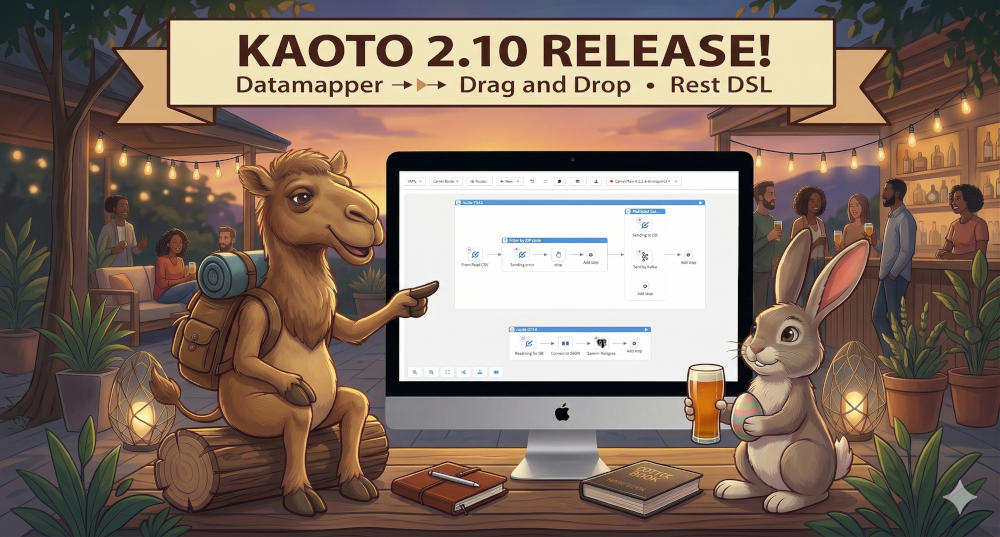
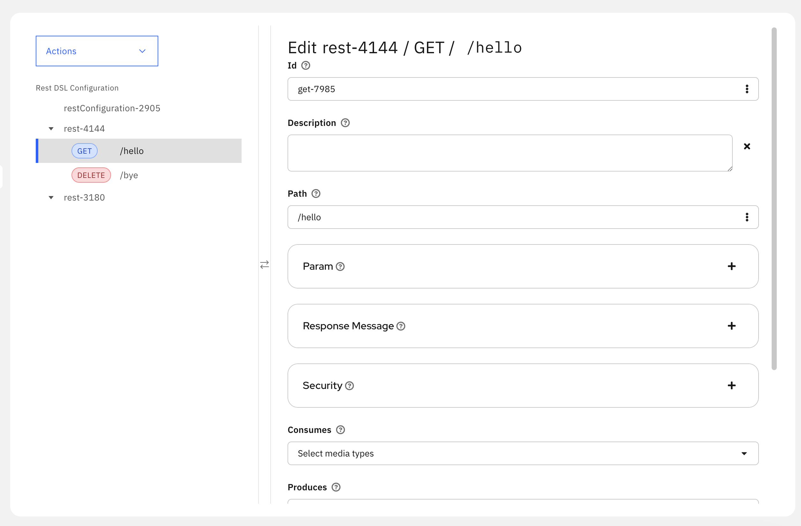
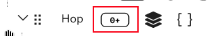
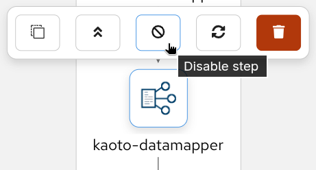
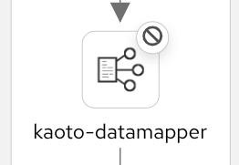
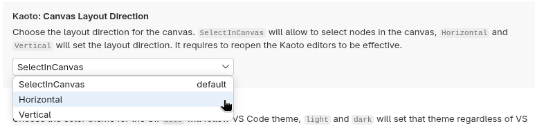
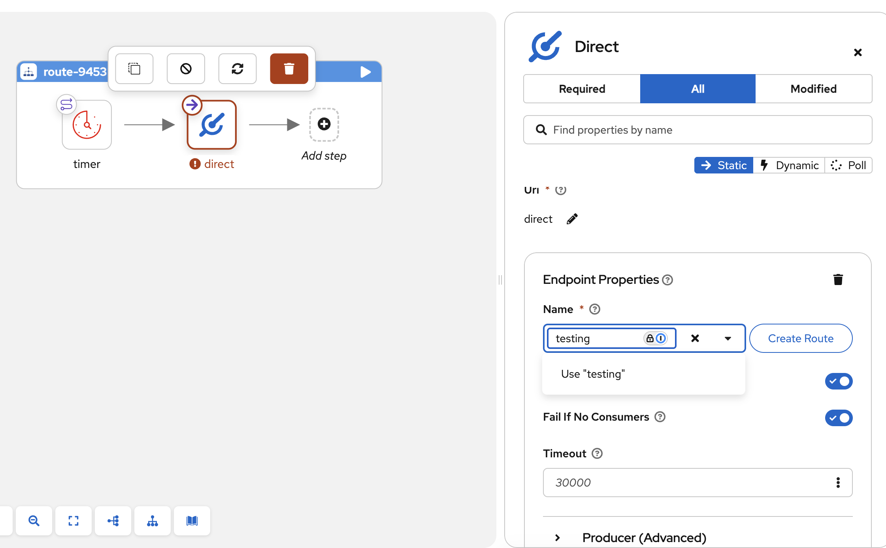
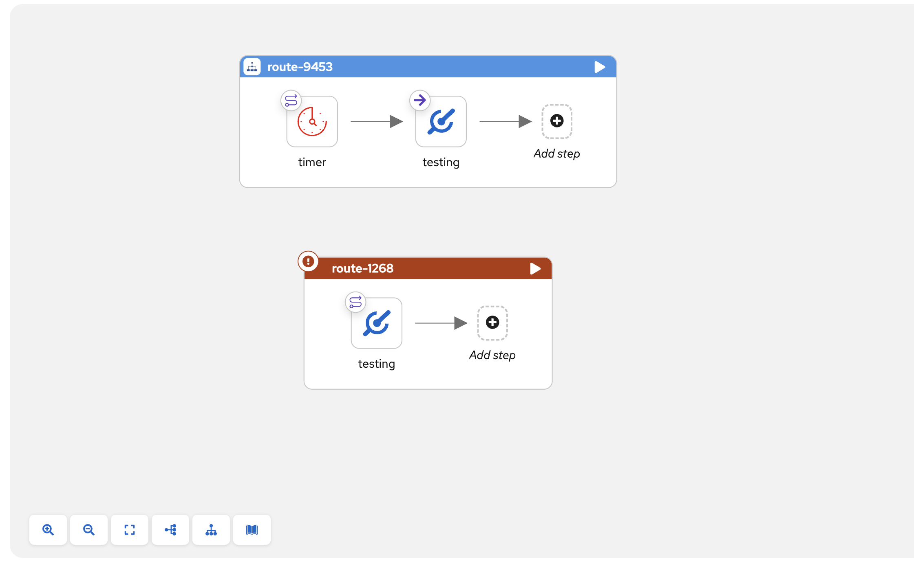
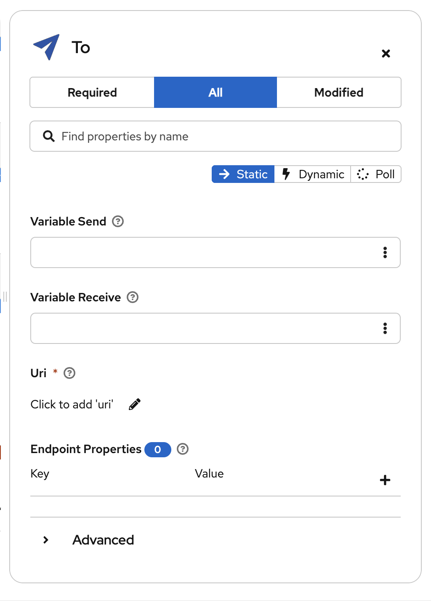
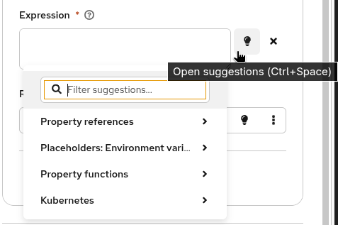

## What's New in Kaoto 2.10?

**Kaoto 2.10** represents a major leap forward in visual integration design, now powered by Apache Camel 4.18.0. This release bridges the gap between API-first design and integration development with full REST DSL and OpenAPI support, while significantly expanding DataMapper capabilities to handle complex multi-file schemas. Combined with production-ready drag-and-drop functionality, building sophisticated integrations has never been more intuitive.

## Here are the key highlights of this release:

### REST DSL Support with OpenAPI Integration

Kaoto 2.10 introduces comprehensive REST DSL support, enabling you to design and configure REST APIs visually within Apache Camel integrations:

- **OpenAPI Specification Import**: Import existing OpenAPI 3.0 specifications from multiple sources (file upload, remote URI, or Apicurio Registry) and automatically generate Camel REST DSL definitions with routes. Selectively choose which operations to import and create skeleton routes with `direct:` endpoints for each operation. This feature bridges the gap between API-first design and integration development, allowing you to leverage existing OpenAPI specifications directly in your Camel routes.



- **Visual REST Configuration**: Configure REST endpoints, operations, and bindings through Kaoto's intuitive tree-based interface. Define REST methods with parameters, security requirements, response messages, and content types while linking operations to Camel routes.

### DataMapper: Multiple Schema Support

The DataMapper has received substantial enhancements for handling complex data transformation scenarios:

#### Multiple Schema Files
Real-world data transformations often involve complex schemas split across multiple files. Kaoto 2.10 now handles these scenarios seamlessly:

- **XML Schema Imports**: Full support for `xs:import` and `xs:include`

- **Dependency Analysis**: Intelligent analysis of schema file dependencies



- **JSON Schema References**: Automatic resolution of JSON `$ref` references across multiple files

#### Enhanced Data Source Support

- **JSON Source Body**: Direct support for JSON source message body as a data source. In the previous version, the JSON source needed to be in a parameter.



#### DataMapper UI/UX Improvements

The DataMapper interface has been refined for better usability:

- **Expansion Panels**: Resizable, collapsible panels for better source data organization



- **Field Type Icons**: Visual indicators for field cardinality with Carbon Design System icons and dark mode support

  1. “Opt” icon for optional field

  2. “0+” icon for optional collection field

  3. “1+” icon for required collection field

- **Zoom Controls**: Font size refinements and zoom controls for large schemas



- **Disable DataMapper Step**: Option to temporarily disable DataMapper transformations

### Canvas and Visual Editor Enhancements

Building integrations is now more intuitive with these canvas improvements:

#### Drag and Drop

After extensive testing and refinement, drag and drop has graduated from experimental to **production-ready status**. This powerful feature is now enabled by default and fully supports complex integration patterns, making route construction faster and more intuitive than ever.

- **Edge Drop Support**: Drop components directly onto connection edges to insert them between nodes

- **Container Drag and Drop**: Move entire container components (like choice, doTry) with all their nested children

- **Visual Feedback**: Real-time visual indicators show valid drop targets with directional cues during drag operations

- **Insert-at-Start Capability**: Insert components at the beginning of containers using special placeholder nodes

- **Enabled by Default**: Drag and drop is automatically enabled for all movable nodes (excluding top-level routes and from endpoints)



#### Layout and Rendering

- **Canvas Layout Direction**: Choose between horizontal and vertical layout orientations to match your workflow preferences

- **Undo/Redo Improvements**: Nodes properly re-render after undo and redo operations, ensuring visual consistency

- **Create Routes from Direct**: Quickly create new routes starting from direct components with a single action

### Forms and Configuration

Configuration forms have been enhanced for better usability:

- **Show/Hide URI**: Toggle URI visibility in component forms for a cleaner, more focused interface

- **Suggestions button**: The form fields now shows a new button to trigger suggestions

### Tests view

A brand new view dedicated to managing and running Citrus tests has been added to the Kaoto sidebar! This view provides a complete testing workflow for your Apache Camel integrations using the Citrus framework.

### Bugfixes

- **XML Bean Parsing**: Correctly parse beans in XML expression parser
- **YAML Entity Sorting**: Entities are now properly sorted when created, maintaining consistent ordering
- **URI Format Support**: Support for URI formats with and without `://` authority separator for flexible component configuration

### Camel Catalog Version
This version includes:
* Camel main: 4.18.0
* Camel extensions for Quarkus: 3.32.0
* Camel Spring-boot: 4.18.0

## Get Started with Kaoto 2.10
Ready to try Kaoto 2.10? You can:

- Install the [VS Code extension](https://marketplace.visualstudio.com/items?itemName=redhat.vscode-kaoto) from the marketplace
- Try the [web version](https://kaoto.io) directly in your browser
- Check out the [documentation](https://kaoto.io/docs) to learn more

## Feedback Welcome
We're always looking to improve Kaoto based on your needs. If you have suggestions, encounter issues, or want to contribute, please reach out through:

- [GitHub Issues](https://github.com/KaotoIO/kaoto/issues)
- [GitHub Discussions](https://github.com/KaotoIO/kaoto/discussions)
- The Apache Camel community channels

Thank you to all the contributors who made this release possible!
