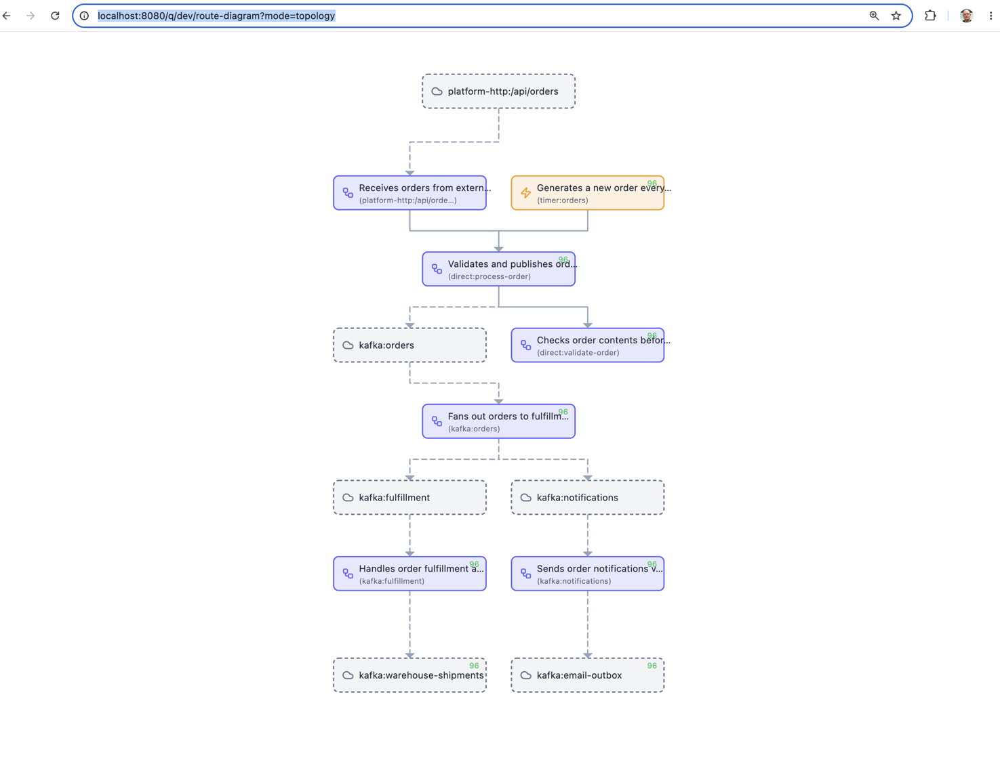
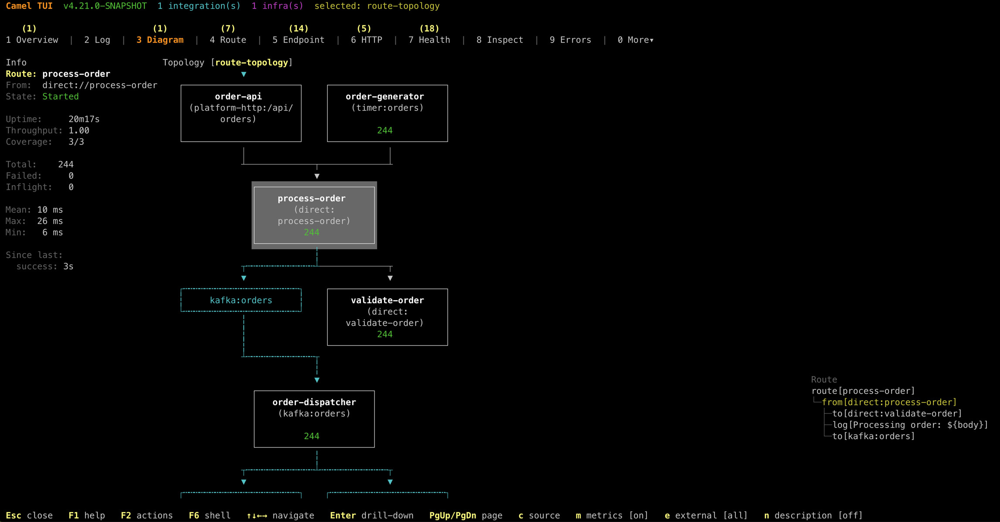

When you have a handful of Camel routes, understanding the message flow is straightforward.
But as your application grows to tens or hundreds of routes connected through `direct`, `seda`, Kafka topics,
and external services, it becomes harder to see the big picture. Which route feeds into which?
Where does a message end up after three hops? Which external systems are involved?

Apache Camel 4.21 introduces **route topology diagrams** to answer exactly these questions.

## Route Diagram vs Route Topology

Camel has had route diagrams for a while — they show the internal structure of a single route:
the processors, EIPs, and endpoints within it.

A **topology diagram** is different. It shows the connections *between* routes — how they are wired
together via shared endpoints, and how they interact with external systems like Kafka brokers,
HTTP services, and databases. Think of it as a bird's-eye view of your entire integration application.

## Topology in the Developer Console

When running with `--console` (or the dev profile), open your browser at:

    http://localhost:8080/q/dev/route-diagram?mode=topology

And you get an interactive topology diagram showing all your routes and their connections:



The diagram above shows an order processing application. You can see at a glance how HTTP and timer
sources feed into a central `process-order` route, which validates orders, publishes to Kafka, and
fans out to fulfillment and notification routes — each with their own downstream Kafka topics.

The topology view supports several query parameters:

- `external=true|false` — show or hide external systems (Kafka, HTTP, etc.)
- `metric=true|false` — show live exchange counters on routes
- `format=html` — interactive SVG (default), or `png`, `text`, `unicode`

## Topology in the Camel TUI

The same topology view is available in the Camel TUI (Terminal UI) under the **Diagram** tab.
Select `route-topology` mode and you get a live terminal-based view with route statistics alongside
the diagram:



The TUI shows route metadata on the left (uptime, throughput, exchange counts, timing), the topology
diagram in the center, and the route definition tree on the right. Everything updates live as
messages flow through the system.

The TUI also supports navigation — you can drill into any route from the topology view to see
its internal diagram, and navigate back to the topology overview. This makes it easy to move
between the big picture and the details without leaving the terminal. Navigation support for
the web-based developer console is planned for an upcoming release.

## Generating Topology Diagrams during Build

You can also generate topology diagrams as PNG files during `mvn test` — useful for documentation
or CI pipelines.

With Camel Main:

```java
@CamelMainTest(mainClass = MyApplication.class,
    dumpRouteDiagramFolder = "doc",
    dumpRouteDiagramTopology = true,
    dumpRouteDiagramTopologyExternal = true)
class MainDiagramTest {

    @Test
    void empty() {
        // empty test method
    }
}
```

With Spring Boot:

```java
@CamelSpringBootTest
@SpringBootTest(classes = MyCamelApplication.class)
@EnableRouteDiagramDump(folder = "doc", topology = true, topologyExternal = true)
public class DumpRouteDiagramTest {

    @Test
    public void empty() {
        // noop
    }
}
```

The topology diagram is saved as `<context-name>-topology.png` alongside the individual route diagrams.

## From the Command Line

You can also view the topology from the command line while your application is running:

```bash
camel cmd route-topology
```

Add `--theme=ascii` for a plain ASCII rendering that works everywhere — terminals, logs, CI output,
or pasted into a chat message:

```text
    +----------------------+    +----------------------+
    |   order-generator    |    |      order-api       |
    |    (timer:orders)    |    | (platform-http:/api/ |
    |                      |    |       orders)        |
    |         499          |    |                      |
    +----------------------+    +----------------------+
                |                           |
                +-------------+-------------+
                              v
                  +----------------------+
                  |    process-order     |
                  |       (direct:       |
                  |    process-order)    |
                  |         499          |
                  +----------------------+
                              |
                +-------------+-------------+
                v                           v
    +----------------------+    +----------------------+
    |   order-dispatcher   |    |    validate-order    |
    |    (kafka:orders)    |    |       (direct:       |
    |                      |    |   validate-order)    |
    |         499          |    |         499          |
    +----------------------+    +----------------------+
                |
                +---------------------------+
                v                           v
    +----------------------+    +----------------------+
    |     fulfillment      |    |     notification     |
    | (kafka:fulfillment)  |    |       (kafka:        |
    |                      |    |    notifications)    |
    |         499          |    |         499          |
    +----------------------+    +----------------------+
```

Or use `--theme=png` to render a full graphical image inline directly in the terminal (supported by
iTerm2, Kitty, WezTerm, and other modern terminal emulators).

And generate individual route diagrams from source files:

```bash
camel cmd route-diagram foo.yaml MyRoute.java
```

## Why This Matters

Integration applications are inherently about connections — between systems, services, and data flows.
A route diagram shows you what happens *inside* a route. A topology diagram shows you what happens
*between* routes. Together, they give you a complete picture of your integration application, from
the high-level architecture down to the individual processors.

No external tooling required. No manual drawing. Just run your Camel application and the diagrams
are there — live in the developer console, live in the TUI, or generated as static images
during your build.

For full documentation, see the [Route Diagram](/manual/route-diagram.html) page in the user manual.
