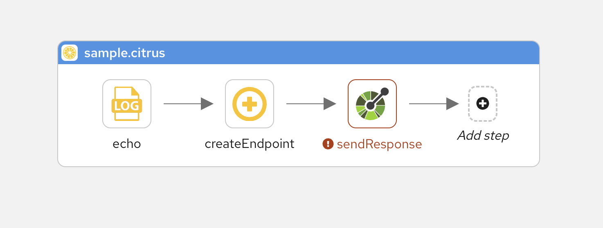
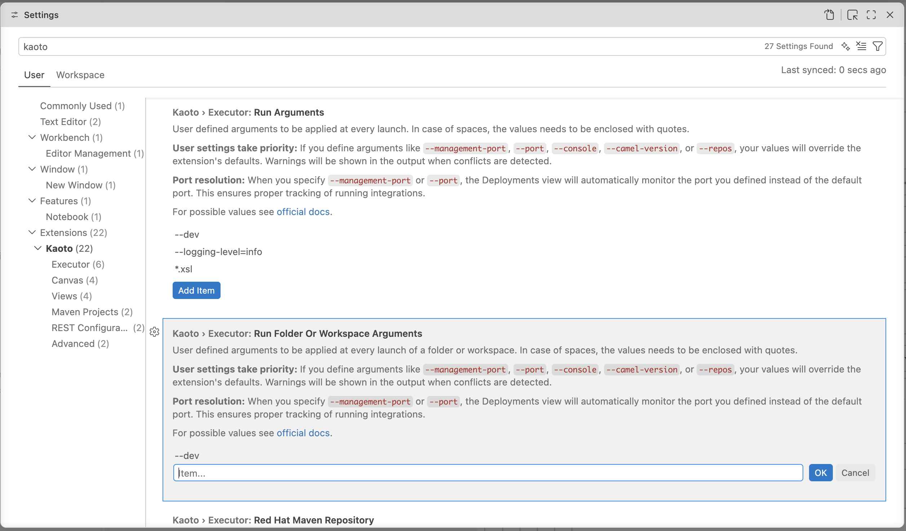

## What's New?

Kaoto 2.11 delivers major improvements across three key areas: automated testing through Citrus framework support, enhanced DataMapper capabilities for handling complex schemas, and flexible runtime management options. Built on Apache Camel 4.20.0, this release strengthens Kaoto's position as a powerful visual integration design tool.

### Citrus Testing Capabilities

The [Citrus framework](http://citrusframework.org) is now fully integrated into Kaoto 2.11, enabling you to create automated tests within the same visual environment where you design your integrations. You can develop and maintain Citrus tests right alongside your Camel routes, validating integration behavior through comprehensive testing.

**Why Citrus?**

Citrus is an Open Source Java test framework with focus on messaging and enterprise integration scenarios. Citrus has evolved as a perfect match for testing Apache Camel integrations, providing first-class integration with Camel including JBang support, infrastructure services, data format capabilities, and multiple test DSLs (Java, YAML) that align with Camel's offerings.

**Visual Test Design**

Build automated tests using Kaoto's visual interface with complete Citrus support. Special icons distinguish test components from integration steps, and the component catalog includes Citrus test actions like send, receive, echo, and sleep for visual test scenario construction.

**Test Configuration and Management**

Test actions use the same property forms you're familiar with from Camel component configuration, enhanced with Citrus-specific endpoint fields. All tests export to standard Citrus YAML, ensuring compatibility with the wider Citrus tooling ecosystem.

This integration unifies development and testing workflows, letting you verify Camel route behavior through visual test design without leaving Kaoto's interface.

### Catalog and Runtime Management

New runtime and catalog management features give you greater control over execution environments and more flexibility in how you run and test your integrations.

**Multiple Execution Options**

Choose between two execution engines based on your needs. The Camel CLI remains the default, offering stable execution with complete JBang feature support, ideal for most development scenarios. For those wanting to explore future capabilities, the experimental Camel Launcher provides an alternative runtime under active development. Each executor serves different purposes: the CLI delivers production-ready testing with proven JBang integration, while the Launcher experiments with new patterns that could bring performance benefits down the road.

**Centralized Configuration**

Settings now control catalog versions, centralizing version management for consistent behavior across all workspace files. Customize execution with your own run arguments, add JVM options, enable Camel features, or adjust runtime parameters as needed. Camel JBang has been updated to version 4.20.0 (from 4.18.0), delivering recent Camel enhancements and fixes.

### DataMapper Enhancements

DataMapper gains powerful new capabilities for managing sophisticated data transformations:

**Rendering Engine Re-invented**

A completely redesigned rendering engine brings enterprise-level performance to DataMapper. Virtual scrolling and native browser rendering enable smooth navigation through extensive mappings and intricate schema structures.



**Advanced Schema Support**

- **Field Override** - Override document fields or types when schemas permit. DataMapper now leverages XML schema extensibility features like `Substitution Group` for element substitution and `xs:extension`/`xs:restriction` for type hierarchies



- **Choice Improvements** - Better `xs:choice` handling with a dedicated context menu for selecting options. Navigate nested choices by drilling down to pick the precise branch at any depth



- **Nillable Attributes** - Proper handling of `xs:element nillable` attributes for nullable fields defined in XML schemas

**UI/UX Improvements**

Drag-and-drop automation simplifies mapping creation:
- Dragging source collections to target collections generates `for-each` mappings automatically
- Container-to-container drops apply `xsl:copy-of` or map individual children
- Double-click any target field to edit XPath expressions directly
- Press Delete to remove mappings quickly
- Add XSLT comments to document transformation logic



### Additional Enhancements

**Canvas and Visual Editor**
- Quick route autoStartup control via title bar toggle
- Hold Space bar to pan the canvas
- Improved visual cues when selecting and dragging containers
- Key/value format for configuring endpoint component properties in forms

**REST DSL**
- Search filter in REST DSL editor to locate properties faster
- Improved accessibility
- Automatic OpenAPI file detection and enhanced handling

## Camel Catalog Version

Kaoto 2.11 includes support for:

- **Camel Main** - 4.20.0, 4.18.2, 4.14.5, 4.10.7
- **Camel extensions for Quarkus** - 3.35.0, 3.33.1, 3.27.4, 3.20.4
- **Camel Spring Boot** - 4.20.0, 4.18.2, 4.14.7, 4.10.9
- **Citrus** - 4.10.0, 4.10.1

For a full list of changes including bug fixes and new contributors, please refer to the [full release notes on kaoto.io](https://kaoto.io/blog/kaoto-2.11-release/).

## Let's Build it Together

Let us know what you think by joining us in the [GitHub discussions](https://github.com/orgs/KaotoIO/discussions).
Do you have an idea how to improve Kaoto? Would you love to see a useful feature implemented or simply ask a question? Please [create an issue](https://github.com/KaotoIO/kaoto/issues/new/choose).

## Give it a try

* Kaoto [quickstart](https://kaoto.io/docs/quickstart/).
* Kaoto is available as a [VS Code extension](https://marketplace.visualstudio.com/items?itemName=redhat.vscode-kaoto).
* Kaoto [showcase deployment](https://red.ht/kaoto).