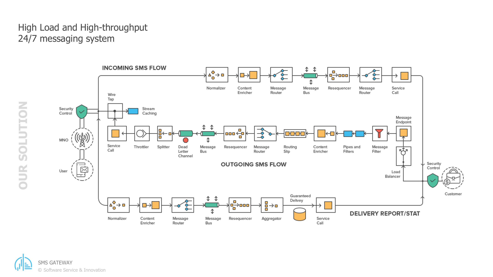
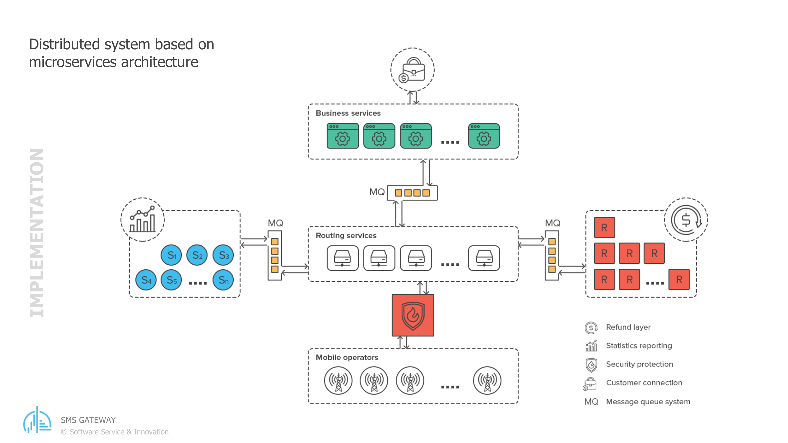

<span style="font-size: 1.2em">By [Andriy Andrunevchyn](https://www.linkedin.com/in/andriyandrunevchyn/), CTO @[Software Service & Innovation](https://soft-innovation.ch/)</span>

*A five-part story of building and running one of Europe's larger SMS gateways.*

In 2011, PayPal gave Echovox twelve months to walk away from the platform its business ran on. This is the story of the platform a small Swiss-Ukrainian team built to replace it, Echonect, and of the boring, durable engineering that has kept it running ever since. It was first published as a five-part series; the five parts are collected here as one.

## Contents

1. PayPal gave us 12 months to rebuild everything. We bet on Apache Camel.
2. Fifteen years, two countries, one platform
3. In praise of boring technology: fifteen years on Apache Camel
4. Under the hood: three things we got right building an SMS gateway on Apache Camel
5. The whole system on one page, and what Apache Camel gives you

## Chapter 1. PayPal gave us 12 months to rebuild everything. We bet on Apache Camel.

In 2011 I got a call that came with a deadline attached.

The short version: PayPal, then owned by eBay, had just [acquired Zong](https://newsroom.paypal-corp.com/eBay-Inc-Completes-Acquisition-of-Zong), a mobile-payments company, for around $240 million. Zong was a spinoff of [Echovox](https://echovox.com/), a Swiss messaging and payments business. When the deal closed, PayPal gave Echovox roughly a year to hand over the software behind it and shut down all of its payment traffic. A year to walk away from the platform the company had been running on.

Most teams in that spot would migrate. Copy what exists, move it somewhere safe, keep the lights on. Echovox could not. The ICON SMS gateway that routed the traffic was part of Zong's assets and intellectual property, and none of that code could be reused. Echobill, the billing side, was fine to keep. The routing gateway was not. So Echovox's new management had no choice but to rebuild from scratch, and decided that if they had to build it again, the new one should be more flexible than the thing they were about to lose. Then they went looking for people who could actually do it.

That is where my team came in. A small group of Ukrainian developers who had worked together before. Echovox asked the one question that mattered: could we have a new platform ready to start migrating their customers, and above all their connections to mobile operators, inside a year? We said yes. We did not have a detailed plan. We had a whiteboard and a lot of nerve.

We also had [Serge Haller](https://www.linkedin.com/in/sergehaller/), Echovox's CTO, who wrote the specifications: a huge stack of documents that pinned down almost every detail of how the new platform should behave. The nerve was ours. The map was his. How that partnership worked, and why it is still working fifteen years later, is Chapter 2 of this story.

### Why Camel, of all things

The first real decision was the backbone. We were building a system that had to take messages in from a hundred-plus external connections, each with its own format and quirks, run business rules over them, and push messages back out to other networks. High volume, many moving parts, and a clock ticking.

We chose [Apache Camel](https://camel.apache.org/). At the time it was not the obvious pick. The two safe options were both bad. Hand-roll our own message router, and spend a year writing plumbing we did not have a year for. Or bolt everything onto a heavyweight enterprise service bus, the kind that was fashionable then, and inherit weight we did not want. Camel sat in between. It is an integration framework built on well-worn patterns for moving messages between systems, and it gave us two things we needed. Development speed, because most of the plumbing we would otherwise have written by hand already existed and was tested. And modularity, because Camel let us treat each route as a self-contained piece we could reason about on its own.

The second point turned out to matter more than the first. When you are connecting to a new mobile operator every few weeks, the ability to add a piece without disturbing the rest of the machine is close to the whole game.

### What we actually built

The platform we shipped, and still run, is a single solution built from four modules, each deployed on its own: one receives everything coming in from providers, one applies the compliance, tariff, and routing rules, one dispatches outbound messages to the external networks, and one handles reporting. They talk to each other over ActiveMQ, asynchronously, so a slow provider on one end cannot freeze the whole pipeline. Chapter 5 walks through the machine properly; this is just the silhouette.

Inside, a message moves through three shapes. It arrives as an inbound SMS. It becomes an outbound SMS once the rules have run. It produces a delivery report once the network confirms what happened to it. We gave those the same plain names in the code that we used on the whiteboard, and fifteen years later the names still hold.

### Speed, and then more speed

The first requirement was 50 messages per second. That was the number in the early spec, and at the time it felt like plenty.

It did not stay plenty. Traffic grew, customers grew, and the target moved to 300 per second, then to 500+ per second on a single node, which is where our latest internal benchmarks sit today. Because each of the four modules scales on its own, we can add nodes when we need them and hold N times 500 per second across a cluster. During big live TV events, the kind where a whole audience votes by text in the same few minutes, that headroom is the difference between a working show and a very bad evening.

How we got from 50 to 500 is an engineering story of its own, and it waits in Chapter 4.

### Fifteen years later

The real timeline: we had twelve months before customer migration had to begin, so the first production-ready version had to ship in ten. It did, and the two months after that went into migrating the providers. Building out the minimal set of features the business needed took about eighteen months. Implementing the full original specification, plus a fair number of things we only worked out we needed once real traffic hit, took three to four years. And it never really stopped. Fifteen years on we are still shipping new features.

That platform is called Echonect, and today it is one of the larger SMS gateways in Europe. It reaches hundreds of mobile operators across the continent, some over direct connections and the rest through 20+ providers, moves millions of messages a day, and has held uptime near 99.97 percent. It carries paid premium messages and free bulk traffic side by side. The four modules are still four modules. Camel is still the backbone.

I am not going to pretend all of it has been smooth. We have rewritten routes we were proud of, chased bugs that only appeared at peak load, and argued about the same design decisions more than once. But the shape we chose in 2011 has held, which is not something I say lightly about software this old.

### What the deadline taught us

The useful thing about a near-impossible deadline is that it forces you to be honest about what matters. We could not gold-plate anything. We had to pick an architecture we trusted, commit to it, and earn the right to improve it later. That discipline is most of the reason the platform is still here.

Fifteen years ago someone handed us a deadline and a hard question. Saying yes to it is still one of the best decisions I have made. The rest of this story is about what that yes turned into.

## Chapter 2. Fifteen years, two countries, one platform

Chapter 1 was about a deadline. This chapter is about the stranger fact underneath it: for fifteen years, a small team of engineers in Lviv and a company in Switzerland have built and run one platform together. Same platform, same core people, two countries. The interesting part is not the technology. It is that it held together this long.

### Who did what

The split was clear from the start, and it barely changed in fifteen years. The Swiss side owned the business: the compliance rules, the tariffs, the relationships with mobile operators, and the specifications. The Ukrainian side owned the engineering.

That engineering covered a lot of ground. Hundreds of operators, each with its own rules and its own idea of a protocol. Premium messages that charge the person receiving them, and free bulk messages that do not. Different legal requirements in every country. The countries we opened read like a map of the continent: France, Belgium, Switzerland, Germany, Spain, Norway, the UK, and on from there, each with its own keyword rules and its own regulator to satisfy. The Swiss side knew all of it and wrote it down. We built it.

I keep coming back to the specifications, because they are the reason this worked. [Serge Haller](https://www.linkedin.com/in/sergehaller/), Echovox's CTO, wrote a huge volume of documents that pinned down almost every small detail of how the system should behave. His specs answered questions before we asked them. What happens to a premium message if the delivery report never comes back? How long do we wait, how many times do we retry, who gets charged if it fails? What does sign-up look like in a country whose regulator demands double opt-in, and what must the goodbye message say when a subscriber texts STOP? That is the kind of thing that sinks a messaging platform if you improvise it. We rarely had to improvise.

The team stayed small on purpose. Four or five software engineers and two QA engineers, most of the time. That is not many people for a system that moves millions of messages a day. It works because the specs are precise and the architecture is modular, so a few people can hold the whole thing in their heads.

### Sitting next to each other, from 1,500 kilometers away

Serge flew to Lviv every second month and sat with us while we worked. That detail matters more than it sounds. A lot of distributed teams fail because "remote" slowly becomes "distant," and distant becomes misunderstanding. We never let that happen. He was in the room often enough that we stayed one team, not a client and a vendor.

It helped that we were an hour apart on the clock and a short flight apart on the map. This was never an offshore-to-save-money arrangement with a twelve-hour gap and a nightly handoff. We worked the same hours, often in the same room, and argued about the same problems in real time.

What makes it work day to day is harder to put in a spec. Serge is precise without being rigid. He will write forty pages defining a feature, then change his mind in an afternoon when the data says he should, and not make it a contest. We disagree often and it never turns personal. After fifteen years you stop counting the disagreements and start trusting that the other person is arguing toward the same goal.

None of that existed at the start. In 2011 we were an unknown team, in a country most of Echovox's competitors had never sourced from. We earned trust the only way you can: by shipping what we said we would, on the dates we said we would. I am careful about the promises I make, and I keep them. Do that for a few years and something shifts.

That partnership eventually took a formal shape. In 2018, Serge and I co-founded [Software Service & Innovation](https://soft-innovation.ch/), a company built out of the same team that had spent seven years proving it could deliver. The Echovox work continues. Now the partnership just has a name.

I still work with Serge most days. Fifteen years in, I still enjoy it. I do not take that for granted.

### What cross-border teams get right

People ask how a two-country team lasts fifteen years without falling apart. My honest answer has three parts, and none of them are clever.

Write things down properly. Precise specifications are what let a small team move fast and a distributed one stay aligned.

Show up in person. Not constantly, but enough. Every second month for fifteen years adds up to a relationship, not a contract.

Match the architecture to the team. Our platform is a set of modules that each stand on their own. So is our team. When the pieces are cleanly separated, a few engineers in one city and a CTO in another can each own their part without stepping on each other.

There is a fourth thing I only notice looking back: keep the same people. Most of what is hard about software is context, the thousand small decisions and the reasons behind them that never make it into any document. When the same few people carry that context for fifteen years, you get faster every year instead of slower. Turnover is the tax most teams pay and never measure.

### What comes next

We are pointing the same approach at AI now, and hiring for the same things we hired for in 2011: people who care, who write things down, and who stay.

Fifteen years ago a Swiss company took a bet on a small team in Ukraine. We are still here, still building, still enjoying the work. That is the part worth writing down.

## Chapter 3. In praise of boring technology: fifteen years on Apache Camel

Our industry likes to rewrite things. New framework, new language, new architecture, roughly every few years, often for reasons closer to fashion than need. I want to make the opposite case. Dan McKinley made the general argument years ago in [Choose Boring Technology](https://mcfunley.com/choose-boring-technology); the platform in this story is my evidence. Fifteen years on the same backbone, and it has never been the thing holding us back. In this trade, boring is a compliment.

### Why it aged well

Camel is an integration framework. Its job is moving messages between systems using a catalogue of patterns that were already well understood when we adopted it. That is exactly why it lasted. We did not bet on something novel. We bet on something proven, and proven things tend to keep working.

The bigger reason is modularity. Four modules, and inside each of them Camel lets us describe every route as a self-contained piece. When everything is cleanly separated, you can change one part without holding your breath about the rest. Over fifteen years, that is the difference between a system you can keep maintaining and one you eventually have to throw away.

None of the rest of the stack was exotic either. Java, Spring, SQL Server and MongoDB for storage, standard SMPP for the operators who speak it. We are on Java 17 and Camel 3.18 today, having moved up over the years. Nothing on that list will surprise anyone. That was always the point.

There were plenty of chances to throw it away and start over. Every few years a new architecture becomes mandatory in conference talks, and someone asks why we are not on it. Reactive everything, a different message bus, a ground-up microservice rewrite. Each time, the honest answer was that the thing we had worked, scaled, and was understood by the people running it. When the boring version already does the job, switching costs a lot and buys little.

### Two upgrades, and a third coming

Fifteen years is long enough to live through major version changes. We have taken Camel through two big upgrades already, and we are planning the migration to the latest version now.

Upgrading a framework that sits at the core of everything is exactly the kind of task that kills old systems. The reason ours survived it twice is the modularity, again. Because the routes are separated and the specs are precise, we can move one part at a time and test it on its own, instead of upgrading the whole machine in one terrifying weekend.

The upgrades were not painless. Camel changed how routes were configured between major versions, and conventions we had relied on were deprecated and then removed. Message headers we had built on had to be reworked across the platform. But because each route was isolated, we fixed and verified them in batches instead of all at once. Boring architecture makes for boring upgrades, and boring upgrades are the ones that actually finish.

### Boring, but not slow

Durability would not matter much if the thing were slow. It is not. The numbers are in Chapter 1, and Chapter 4 shows the work behind them; the short version is that a platform specced for 50 messages per second now runs ten times that on every node.

Peak traffic in this business arrives in seconds. When a television host says "text now," a whole audience votes at once, and a framework you understand deeply is one you can tune for that moment. A fashionable one you adopted last year is not.

### The part competitors cannot copy quickly

Throughput gets the attention. The connector library is the real moat.

Echonect reaches hundreds of operators, some over direct connections and the rest through 20+ providers, built up over fifteen years, each integration a small, self-contained connector. Because every connector follows the same shape, adding a provider, and with it a new country or a better commercial deal, is measured in days, not months. The pattern is no secret; Chapter 4 takes it apart. Any capable team could copy the shape of it. What they cannot copy quickly is the library itself: thirty-plus working integrations, each one carrying years of a single provider's quirks, and the operator relationships and commercial agreements that stand behind them. When the business wants to open a market, the technology is rarely what holds it up. That is worth more than any single performance number.

### Still building

The other sign that boring technology works: we are still adding to it. Fifteen years in, we are still shipping new features for Echovox: fraud prevention, a compliance validator, smarter routing. Smart routing picks the best path for each message across hundreds of operators in real time. The compliance validator checks a message against the destination country's rules before it is ever sent. Adding features of that size to a fifteen-year-old core, without the whole thing groaning, is the clearest proof I have that boring paid off.

I will be honest about the cost. Boring is not free. It means saying no to interesting rewrites, resisting the urge to adopt every new thing, and doing patient maintenance that no one applauds. Some of that work is genuinely dull. It is also why the platform is still here and still fast.

The tools will keep changing. Boring, in the sense of durable and well understood, is still the highest compliment I can pay a piece of software.

## Chapter 4. Under the hood: three things we got right building an SMS gateway on Apache Camel

The first three chapters were story and argument. This one is engineering: three technical decisions, all resting on [Apache Camel](https://camel.apache.org/), that I am still proud of fifteen years later, plus the change that did the most for our throughput.

First, the shape of the system. Three kinds of traffic move through Echonect: messages from phones coming in, which we call MOs, messages going out, MTs, and delivery reports coming back for what we sent, DVRs. This chapter mostly follows the outbound path. The whole thing is a set of Camel routes, defined in a `camel-config.xml` per module with a few Java route builders for the dynamic per-provider dispatch. Normalize the input, route it, throttle it, split it, marshal it onto a queue, hand it off. If you have read the Enterprise Integration Patterns book, our flow looks a lot like its table of contents. That is not a coincidence. Camel gives you those patterns as building blocks, so we built with them.

A handful of those patterns do the heavy lifting on every route, and I will point at them as they come up. None of what follows is code we wrote from nothing. It is Camel, configured.



*The high-level design: incoming, outgoing, and delivery-report flows laid out as a chain of named Camel patterns.*

### 1. Every connection is its own JAR

This is the one I am proudest of.

Each provider connection is a separate subproject. It builds into its own JAR, and the modules that talk to providers pull that JAR in as a dependency. Inside, the connector speaks the provider's language: their wire format, their quirks, their idea of what a delivery report looks like. Outward, to the rest of the system, it speaks only our internal language. CommonMt for an outbound message, CommonDvr for a report. The connector has one job, and that job is translation between those two worlds.

```
Provider                 Connector JAR             Main module
(SMPP / UCP / HTTP  <->  one per provider,   <->   business + routing,
 XML / JSON)             isolated + testable,      provider-agnostic
                         speaks CommonMt/CommonDvr (never sees the wire format)
```

Inside a connector there are three small pieces, one for messages coming in, one for messages going out, one for the delivery reports. That is the whole contract. Draw that boundary once and it pays off for years:

- We test each connection on its own, without standing up the rest of the platform.
- One provider's mess stays inside that provider's JAR. A broken or strange integration cannot reach into another.
- Every piece of provider-specific logic lives in exactly one place, behind a known interface.

The quirks are real, and this is where they go to be tamed. One provider uses status codes that mean something different from everyone else's, so its connector maps them onto ours. Another speaks a binary protocol over a socket while its neighbor speaks XML over HTTP, so each connector owns its own transport and hides it. All of that lives inside one JAR, and none of it leaks into the core.

The practical result is speed. Adding a provider means writing one connector against a format we have not seen before, then adding its JAR. Nothing else changes. So when we open a new country, most of our customers find out the same way: a short note that the country is now available. The engineering behind it is invisible to them, which is how it should be.

### 2. Reporting that does not punish our customers

The second one we learned the hard way.

Every message produces at least two delivery reports. A customer sending millions of messages a day is, by definition, owed several million report callbacks a day in return. In the early days we forwarded each report the instant we received it. It seemed obviously right. You want your reports fast.

It was not right for our biggest customers. The ones sending the most traffic got hit with the most reports, all at once, and their own systems buckled. We had turned our throughput into their problem.

So we built a backpressure layer into the reporting module. Instead of firing reports the moment they arrive, it measures how many each customer can take in a given window and releases them at that pace. As fast as they can handle, and no faster. We already used Camel's throttler to hold each provider to its allowed send rate, so we knew the tool; here we pointed the same idea at the reports going back to customers. The customer stops drowning. The reports still arrive, at a rate their system can actually process.

It is a small idea with a large effect, and the kind of thing you only find by running a system at real scale for real customers.

### 3. An API we have never broken

This is the least glamorous of the three and probably the most valuable commercially.

Our first customers integrated with Echonect around fourteen years ago. Those same customers can still call the API today with exactly the code they wrote back then. We have never broken backward compatibility. Not once in fourteen years.

One more thing makes the API easy to live with: it is country-independent. A customer sends us two things, the message body and a mobile number. That is all. They do not tell us the country, the operator, or the route. We work out where the number lives and how to reach it, and we send it. All the complexity of every operator we connect to, each with its own protocol and rules, sits on our side of the line, not theirs.

I did not always see how much this matters. Then I spent years on the other side of that line, integrating with dozens of provider APIs, each one different, several of them changing under me without warning. That is when it clicked. What a customer wants from a gateway is not a clever API. It is a simple one that does not change. Send a body and a number, get a result, and trust that the integration you wrote once will still work in a decade. We built that, we have kept it, and it is a large part of why our oldest customers are still our customers.

### Getting from 50 to 500

Chapter 1 gave the arc: 50 messages per second in the first spec, 500 per node in today's benchmarks. Getting from one number to the other took years and a lot of small wins. Two of them mattered more than the rest, and both live close to the Camel layer.

The first was serialization. The four modules hand messages to each other over ActiveMQ, which means serializing a CommonMt or CommonDvr on one side and rebuilding it on the other, millions of times a day. We had been doing that with XML. XML is easy for a human to read and expensive for a machine to move: the payloads are large, and parsing them burns CPU on every hop. We switched those internal messages to Protostuff, a compact binary encoding driven by runtime schemas. Smaller on the wire, far cheaper to marshal and unmarshal, much less garbage for the collector to chase. On a path that runs more than 1,000 times a second, that difference is not small.

The reason it was a safe change is pure Camel. Serialization in a route is just a data format you marshal and unmarshal. We wrote the Protostuff codec as a custom Camel `DataFormat`, registered it once, and pointed the marshal and unmarshal steps at it. The routes themselves did not change. The messages got smaller and faster, and nothing else had to know.

The second lever was the queues. Between modules, ActiveMQ carries the traffic, with a pool of consumers on each queue so many messages move in parallel. But for the very hottest stages inside the messaging module, going out to a broker at all is too much overhead, so there we use an LMAX Disruptor, a lock-free ring buffer that hands work between threads with almost none. Binary payloads on the queues, a Disruptor on the tightest loops, and a lot of profiling in between: that is most of how 50 became 500.

### The thread

None of the three decisions are flashy. A packaging convention, a rate limiter, and a promise not to break an interface. Together they are why Echonect scaled without fragmenting, grew without drowning its customers, and kept the people who signed up first.

They share one root: pick a clean boundary, then respect it for years. The connector JAR holds the boundary between a provider and our core. The backpressure layer holds the boundary between our load and the customer's. The stable API holds the boundary between what we change and what they depend on. Camel made those boundaries cheap to draw and easy to keep.

## Chapter 5. The whole system on one page, and what Apache Camel gives you

Chapter 4 went deep on three decisions. This last chapter pulls back: the whole of Echonect on one page, and an honest account of what [Apache Camel](https://camel.apache.org/) gives you when you build something like it.

### Four modules and a queue

Echonect is one solution built from four modules. Each is small, each does one job, and they talk to each other over ActiveMQ.

Messaging is the front door. Providers reach it over whatever protocol they speak: HTTP, SMPP or UCP for the operators we connect to directly. What arrives is messages coming in from phones, and delivery callbacks for messages we already sent. Messaging takes them in, turns them into our internal shape, and drops them on a queue. Business is the brain. It applies the rules, compliance, tariffs, capping, fraud checks, routing, and decides what to send and where. It also hosts the API our customers submit their outbound messages on. Endpoint is the mouth. It takes an outbound message and hands it to the right provider, over whatever protocol that provider happens to speak. Reporting is the memory. It reads the stream of events and writes down what happened, so the business can see its own traffic in numbers.

Between the four sits ActiveMQ. Nothing calls anything else directly. A module drops a message on a queue and moves on, and another module picks it up when it is ready. That one choice, async hand-off instead of direct calls, is why a slow provider or a busy hour in one place does not freeze the rest. It is also why we can run more copies of whichever module is under pressure without touching the others.



*The modules as separate services, with message queues between them and the mobile operators along the bottom.*

### Following one message

Follow a single message through and the shape becomes clear.

A phone sends a text to one of our short codes. The provider forwards it to messaging, which turns the provider's format into a CommonMo, our word for an inbound message, and queues it. Business picks it up, runs its rules, and passes the MO on to the customer whose service that short code belongs to. The reply is theirs to make, not ours: the customer submits an MT back through our API, which becomes a CommonMt on a queue to endpoint. Endpoint asks the right connector to translate the CommonMt into the provider's own format and send it. Later the network tells us what happened, and that delivery report, a CommonDvr, comes back in through the front door, updates the message's status, and flows on to reporting.

Three plain models carry everything: CommonMo in, CommonMt out, CommonDvr for the result. Every provider we connect to is mapped to those three at its own edge, inside its own connector, so the core of the system only ever deals in our vocabulary and never in theirs. That edge, one isolated connector per provider, is the abstraction layer the whole business runs on. It is what lets us open a new country by adding one connector while everyone upstream keeps working exactly as before.

State lives in two places, and neither is exotic. The transactional record, every message and its status, sits in SQL Server, which we reach over plain JDBC through a shared data-access layer and two connection pools. The outbound messages themselves, and a cache the modules share, live in MongoDB. Boring on purpose; Chapter 3 made that case.

### What Camel actually gives you

That architecture is not clever, and that is the point. What made it pleasant to build, and cheap to keep alive for fifteen years, is Camel. A few things stand out.

The first is a shared vocabulary. Camel is built on the Enterprise Integration Patterns, so router, splitter, wire tap, and throttler are not private jargon we invented. They are named, documented patterns with known behavior, and they do real work here every second. A content-based router reads a header and sends each message to the right per-provider queue. A recipient list turns one route into a dynamic dispatcher, choosing the destination from the message itself, which is how a single set of routes serves every provider we connect. When an engineer joins, they are not memorizing our tricks, they are learning Camel, and our system is mostly Camel. Design conversations are shorter because everyone is pointing at the same catalogue.

The routes are also readable. Our flows are declared in a camel-config.xml per module. You open the file and follow where a message goes, step by step, instead of reconstructing it from call stacks. The wiring is data you can read, not logic you have to excavate.

Then there is the reach. Camel ships hundreds of components, one for each kind of system you might talk to, and we lean on a handful: HTTP for provider APIs, JMS for ActiveMQ, Netty for socket protocols, a servlet for our own front door, a Disruptor for the hottest in-memory paths, Quartz for scheduled jobs. Because an endpoint is just a URI, the same route logic can read from a queue today and a socket tomorrow, and the business rules never learn how a message arrived. That separation is most of why adding providers and changing transports over the years rarely reached the core.

Serialization and concurrency are handled the same way, as configuration rather than code. When we replaced XML with binary Protostuff on the queues, the change I walked through in the previous chapter, we wrote one data format and pointed the routes at it, and the routes did not change. Throttling a provider to the exact send rate it allows, running many consumers on a queue, tapping traffic off to statistics on a separate thread pool so reporting never slows the delivery path: these are settings, not threading code we have to write and then debug at two in the morning.

Failure is a first-class idea too. An `onException` block says what happens when a send fails, right next to the route it protects, and hands the message to a retry path with the attempt count carried in a header, so error handling lives with the thing it guards instead of scattered through the codebase. And because a route is just a small, declared pipeline, we can test each one on its own.

Last, there is the plain virtue of longevity. Camel is old, active, and everywhere, which means the documentation is deep, most answers are already on the internet, and the project keeps shipping fixes and improvements we get for free. When you write your own integration layer, every bug in it is yours forever. When you build on something like Camel, a large community is quietly maintaining the hard parts alongside you.

### The honest part

Camel is not magic, and I will not pretend it is. The XML gets verbose. The learning curve is real. A framework this general hands you enough rope to build a mess if you are not disciplined about it. We have made some of those messes and cleaned them up.

But fifteen years and two major upgrades later, with a third on the way, I have never once wished we had written our own integration layer instead. That is about the highest thing I can say about a piece of infrastructure.

### The takeaway

So that is Echonect. Four small modules, one queue, three plain message models, and a lot of Camel doing the unglamorous work of moving messages between systems that were never designed to talk to each other.

Fifteen years ago it was a whiteboard, a stack of specifications, and a deadline nobody sane would accept. It is still running, still fast, still growing, kept alive by the same small team for the same Swiss company. Most software this age is called legacy. This one is finished in the middle and busy at the edges, which is exactly where we want it.

[Serge Haller](https://www.linkedin.com/in/sergehaller/) and I now spend a growing share of our time building AI systems at <a href="https://soft-innovation.ch/">Software Service &amp; Innovation</a>. New domain, same rule we bet on in 2011: pick tools that give you a shared vocabulary and clean seams, then let them be boring. The best infrastructure is the kind you eventually stop having to think about.
