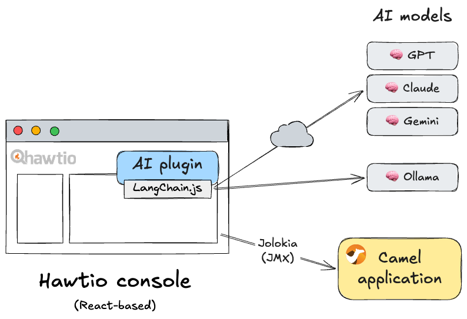
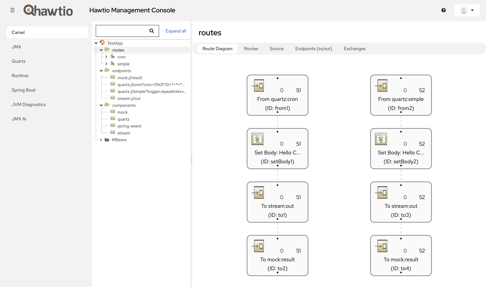
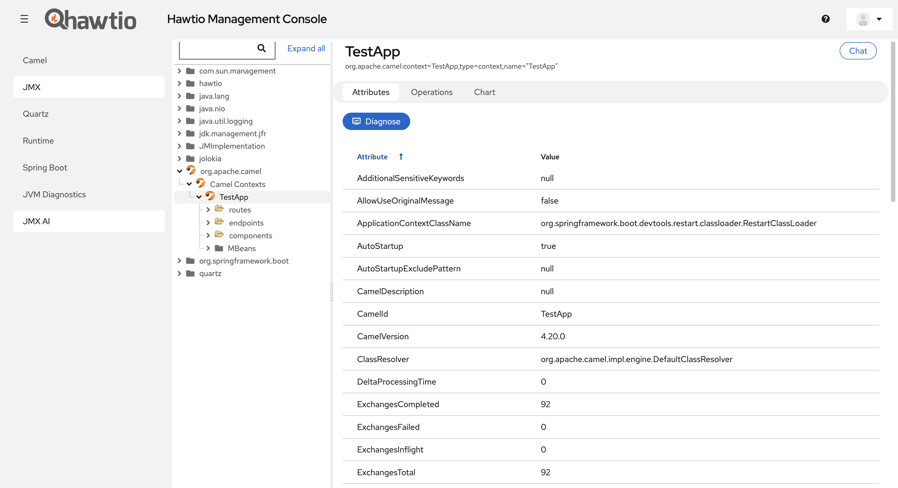
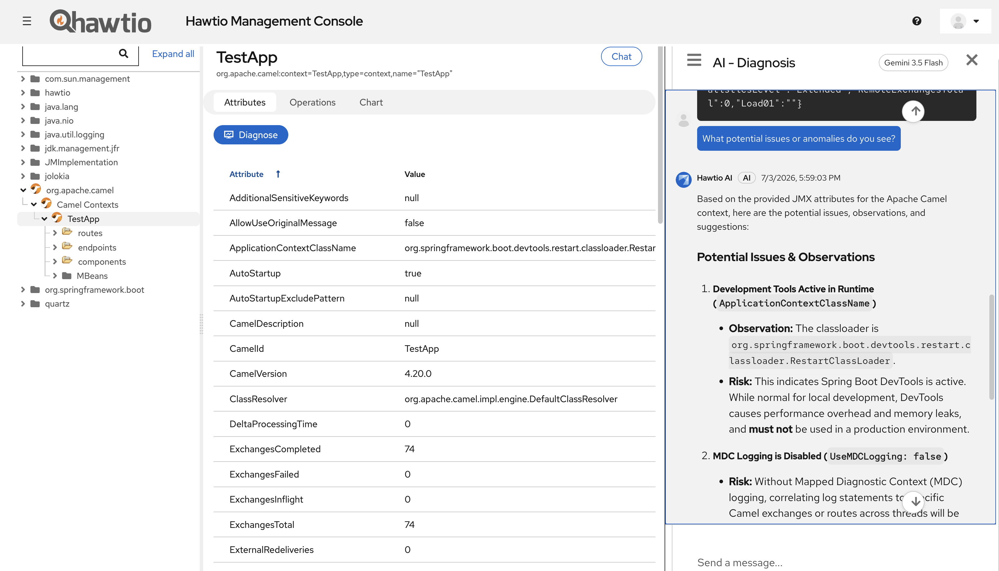

## Apache Camel and AI

AI is a hot topic in the Apache Camel community.
When thinking about how to leverage AI in the Apache Camel ecosystem, there are broadly two directions:

1. Incorporating AI services into Apache Camel integrations themselves
2. Utilizing AI services in the development and operation of Apache Camel integrations

Direction 1 includes the [Apache Camel AI components](/components/4.18.x/ai-summary.html). Combining the [Wanaku MCP router](https://www.wanaku.ai/), which has been featured on this blog several times, with Camel also falls into this category.

Direction 2, on the other hand, applies AI at a completely different phase from direction 1. Not as much has been attempted here yet, but an ambitious AI coding assistant tool called [Camel-Kit](https://github.com/luigidemasi/camel-kit) is currently under development. [Kaoto](https://kaoto.io/) would also be a candidate in this category.

[Hawtio](https://hawt.io/) is the de-facto tool and console for managing and diagnosing Camel applications. Within the Camel ecosystem, it sits in a unique position to apply AI at this operational phase.

## What is Hawtio AI?

[Hawtio AI](https://github.com/hawtio/hawtio-ai-plugin), currently under development by the Hawtio team, is a subproject that extends Hawtio's traditional JMX over HTTP management and diagnostics capabilities with AI.

Hawtio AI is implemented as one of Hawtio's plugins. Users can enable Hawtio AI functionality in their Hawtio console by opting in to the dependency as follows:

```xml
<dependency>
    <groupId>io.hawt.ai</groupId>
    <artifactId>hawtio-ai-plugin</artifactId>
    <version>0.2.2</version>
</dependency>
```

The Hawtio AI plugin is currently at version 0.2 and is still at the MVP stage. I am writing this blog post to give people an early look at the idea of using AI for managing and diagnosing Camel applications, along with Hawtio AI itself.

## Design Overview

The core design of the Hawtio AI plugin is a LangChain.js-based AI agent running in a React frontend. You can switch between AI models provided by various providers (including local models) from the preferences panel.



It supports one AI model connection per Hawtio session. Application information, such as Camel context health and route statistics, can be retrieved via Jolokia/JMX and sent to the model to perform intelligent operations.

> **NOTE:** As described later, application data is never sent to an AI model without the user explicitly pressing the submit button.

While the set of AI models supported at this point is limited, we are considering future support for connections to models hosted on private clouds and to MCP servers.

## Diagnosis

The Hawtio AI plugin is still at the MVP stage, and the only implemented feature is "Diagnosis."
However, this single feature should be enough to give you a sense of Hawtio AI's potential.

Below is a screenshot of Hawtio web console attached to a `TestApp` Camel Spring Boot application with two routes (`cron` and `simple`).



In the left-hand menu, a new view named "JMX AI" has been added at the bottom alongside Hawtio's built-in views. This is the view provided by the Hawtio AI plugin.

The JMX AI view is a replica of the existing JMX view, but with two new additions: a "Chat" button in the upper right of the view, and a "Diagnose" button in the Attributes tab.



This "Diagnose" button provides the "diagnosis" feature. It passes the attribute data of the currently displayed node (MBean) to the AI model and asks whether there are any potential anomalies or issues.

The diagnosis result is displayed as a response from the AI in a chat view that opens from the right edge, as shown below. You can also continue chatting with the AI about the diagnosis result in this chat view.



By selecting a different MBean node from the JMX tree on the left, you can diagnose the application's status from various perspectives.

## Ideas Towards Version 1.0

The "Diagnosis" feature is the most general-purpose feature for showcasing Hawtio AI's potential.

As we work toward completing Hawtio AI as version 1.0, we plan to implement the following additional ideas on top of this foundational base:

- Implementing one-shot prompting features tailored to specific use cases
- Registering the JMX workspace and Jolokia interface as tools
- Extending the Hawtio core SPI to embed functionality into existing plugin views
- Establishing security and AI permission controls

### Implementing One-Shot Prompting Features Tailored to Specific Use Cases

AI for application management and diagnostics is most powerful when focused on specific use cases. We will implement a set of features that allow one-button invocations of operations targeting specific MBeans for runtimes/frameworks including Camel, with tailored system prompts. This will also include automation capabilities that perform actual management operations via MBean invocations.

### Registering the JMX Workspace and Jolokia Interface as Tools

AI agents can extend their general intelligence through tools. When rendering the JMX MBean tree, Hawtio already holds the full application's MBean information in its workspace, and the agent can access this information without needing to query the server runtime again. All that is needed is to register the workspace itself as a tool with the AI model.

Furthermore, if the agent determines that it needs to invoke some MBean operation on the server during an interaction with the user, the user should be able to authorize the agent to do so. Registering Hawtio's existing Jolokia interface as a tool with the AI model is all it takes.

We have already developed the [Jolokia MCP Server](https://github.com/jolokia/jolokia-mcp-server), but for Hawtio AI's purposes, there is no need to introduce a new server layer, as exposing the workspace and Jolokia interface as tools within the frontend is sufficient.

### Extending the Hawtio Core SPI to Embed Functionality into Existing Plugin Views

Hawtio AI's JMX AI is provided as a separate view, but it would be more convenient if the AI plugin could inject AI capabilities directly into existing plugin views. Achieving this requires extending the current Hawtio core SPI.

### Establishing Security and AI Permission Controls

Finally, to make AI usable in enterprise environments, sufficient security and permission control mechanisms are essential. In particular, it is important not to allow the AI agent to send data or execute operations unintentionally. A mechanism similar to RBAC that controls access and execution permissions at the MBean level, down to individual attributes and operations, is needed. The defaults should also be safe and restrictive.

## Next Steps

Hawtio, including the Hawtio AI plugin, is an open source project licensed under Apache 2.0.

The Hawtio AI plugin is under active development in this project. Opinions, ideas, feedback, and contributions are very welcome.

- <https://github.com/hawtio/hawtio-ai-plugin>

If you are new to Hawtio, start here:

- [hawt.io - Get Started](https://hawt.io/docs/get-started.html)

If you are interested in contributing to Hawtio itself, please visit this project:

- <https://github.com/hawtio/hawtio>
