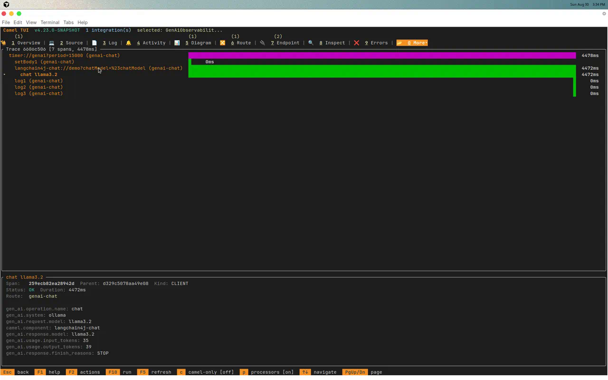

Once LLMs live inside Camel routes, the next question is always the same: *how much are we spending, and
where is latency coming from?* Apache Camel **4.23** introduces **GenAI observability** — OpenTelemetry spans
and Micrometer metrics for LLM producers, aligned with the
[OpenTelemetry GenAI semantic conventions](https://opentelemetry.io/docs/specs/semconv/gen-ai/).

This is **Blog 1** in a two-part series. We start with the fastest path to visible AI telemetry: the
[Camel CLI](/manual/camel-jbang-jdk-installation.html), a LangChain4j chat route, [Ollama](https://ollama.com/),
and the Camel TUI — no Spring Boot required.

## The three phases of Camel Gen AI

| Phase | Name | What you do |
|-------|------|-------------|
| 1 | **Connect** | Wire LLMs into routes (`langchain4j-chat`, `openai`, Spring AI) |
| 2 | **Act** | Give AI tools via `ai-tool:`, agents, MCP server, A2A |
| 3 | **Operate** | Run in production with guardrails, RAG, and **GenAI observability** |

This post covers Phase 1 plus the first observability prototype.
[Part 2](/blog/2026/08/camel-genai-observability-spring-boot/) moves to Spring Boot and a full observability
stack (Prometheus, VictoriaTraces, Perses).

## What you'll build

A timer-driven route that calls Ollama every 15 seconds. For each LLM invocation you get:

- Micrometer timer: `gen_ai.client.operation`
- Micrometer counter: `gen_ai.client.token.usage` (tags `input` / `output`)
- OpenTelemetry child spans with `gen_ai.request.model`, token counts, finish reason
- Exchange headers: `CamelLangChain4jChatRequestModel`, `CamelLangChain4jChatResponseModel`
- TUI **Spans** tab visualization + AI Usage view (**Ctrl+U**)

```
timer:genai (every 15s)
  └─ langchain4j-chat (Ollama ChatModel)
       ├─ camel-ai-observability-api  → start GenAI span + record metrics
       ├─ camel-opentelemetry2          → export span attributes
       └─ camel-micrometer            → gen_ai.client.* metrics

camel run --observe
  └─ camel-observability-services
       ├─ /observe/health
       ├─ /observe/metrics  (Prometheus format)
       └─ TUI Spans collector (embedded OTLP for dev)

camel tui
  ├─ Spans tab (shortcut: o)
  └─ AI panel + Ctrl+U (CLI ask + route GenAI usage combined)
```

## Prerequisites

- Camel CLI **4.23+** (`camel version`)
- Ollama installed and running

```shell
ollama pull llama3.2
ollama serve
```

## Run the example

The example lives in the [camel-jbang-examples](https://github.com/apache/camel-jbang-examples) repository at
[`ai/genai-observability`](https://github.com/apache/camel-jbang-examples/tree/main/ai/genai-observability).
It is registered in the CLI example catalog so you can also browse and launch it from the
[Camel TUI](/manual/camel-jbang-tui.html) example browser.

Clone the example:

```shell
git clone https://github.com/apache/camel-jbang-examples.git
cd camel-jbang-examples/ai/genai-observability
```

Run with observability enabled:

```shell
camel run GenAiObservabilityRoute.java application.properties \
  --observe \
  --dependency=camel-langchain4j-chat \
  --dependency=camel-ai-observability \
  --dependency=langchain4j-ollama
```

> **Note:** Today you must pass `--dependency` for LangChain4j and GenAI observability components.
> A JIRA ticket will track auto-discovery of these dependencies in a future Camel CLI release.

The `--observe` flag adds `camel-observability-services`, enables health checks, Micrometer metrics,
OpenTelemetry tracing, and powers the TUI **Spans** tab on the management port (default `9876`).

Alternatively, start the bundled observability stack with
[`camel infra run observability`](/blog/2026/08/camel422-whatsnew/#observability-stack) and run the route
with `--observe` — metrics and traces flow to Prometheus and VictoriaTraces without extra setup.

Wait for log lines like:

```text
LLM reply: Apache Camel is an open source integration framework...
Request model: llama3.2
Response model: llama3.2
```

## Inspect Prometheus metrics

```shell
curl -s http://127.0.0.1:9876/observe/metrics | grep gen_ai
```

Example output (abbreviated):

```text
# HELP gen_ai_client_operation GenAI client operation duration
gen_ai_client_operation_count{gen_ai_operation_name="chat",gen_ai_system="langchain4j",...} 3.0

# HELP gen_ai_client_token_usage GenAI token usage
gen_ai_client_token_usage_total{gen_ai_token_type="input",...} 42.0
gen_ai_client_token_usage_total{gen_ai_token_type="output",...} 18.0
```

## Explore spans in the TUI

Open a second terminal:

```shell
camel tui
```

1. Select the running integration (`genai-observability` or similar)
2. Press **o** or navigate to **More → Spans**
3. Wait for the next timer tick (~15s) and watch a new span appear



Each LLM call creates a child span with `gen_ai.operation.name=chat`, model attributes, and token usage.
See the [OpenTelemetry Spans section](/manual/camel-jbang-tui.html#_opentelemetry_spans) in the TUI manual
for a walkthrough of the Spans tab layout.

Key span attributes:

| Attribute | Meaning |
|-----------|---------|
| `gen_ai.operation.name` | e.g. `chat`, `embeddings` |
| `gen_ai.system` | Provider abstraction (e.g. `langchain4j`) |
| `gen_ai.request.model` | Model requested |
| `gen_ai.response.model` | Model that served the response |
| `gen_ai.usage.input_tokens` | Prompt tokens |
| `gen_ai.usage.output_tokens` | Completion tokens |
| `camel.component` | e.g. `langchain4j-chat` |

Press **Ctrl+U** in the AI panel to toggle the **AI Usage** view — token consumption from both
TUI `camel ask` prompts and route LLM calls on one screen.

## Example route

The example uses Java today. Camel is also on a mission to make LLM routes approachable in YAML DSL and
Kamelets for non-Java developers — expect GenAI observability to work the same way once those DSLs support
the same components.

```java
import dev.langchain4j.model.chat.ChatModel;
import dev.langchain4j.model.ollama.OllamaChatModel;
import org.apache.camel.builder.RouteBuilder;

import static java.time.Duration.ofSeconds;

public class GenAiObservabilityRoute extends RouteBuilder {

    @Override
    public void configure() throws Exception {
        String baseUrl = getContext().resolvePropertyPlaceholders("{{ollama.baseUrl:http://localhost:11434}}");
        String modelName = getContext().resolvePropertyPlaceholders("{{ollama.model:llama3.2}}");
        ChatModel chatModel = OllamaChatModel.builder()
                .baseUrl(baseUrl)
                .modelName(modelName)
                .temperature(0.2)
                .timeout(ofSeconds(120))
                .build();
        getContext().getRegistry().bind("chatModel", chatModel);

        from("timer:genai?period={{genai.period:15000}}")
                .routeId("genai-chat")
                .setBody(constant("In one sentence, what is Apache Camel integration?"))
                .to("langchain4j-chat:demo?chatModel=#chatModel")
                .log("LLM reply: ${body}")
                .log("Request model: ${header.CamelLangChain4jChatRequestModel}")
                .log("Response model: ${header.CamelLangChain4jChatResponseModel}");
    }
}
```

### application.properties

```properties
ollama.baseUrl=http://localhost:11434
ollama.model=llama3.2
genai.period=15000

# GenAI observability — enabled by default when backends present
camel.aiObservability.enabled=true
```

GenAI observability also covers `openai:` — run with `--dependency=camel-openai` and the same
`--observe` flag; spans use the same `gen_ai.*` attributes.

## What's instrumented today

| Component | Operations observed |
|-----------|---------------------|
| `langchain4j-chat` | Chat completions |
| `langchain4j-tools` | Tool-augmented LLM calls |
| `langchain4j-agent` | AI Service agent loops |
| `langchain4j-embeddings` | Embedding generation |
| `openai` | Chat, embeddings, Responses API, etc. |

## Troubleshooting

| Symptom | Fix |
|---------|-----|
| No `gen_ai` metrics | Confirm `--observe` or manual observability config; check `camel-ai-observability` on classpath |
| Empty Spans tab | Wait for at least one LLM call; verify `camel.opentelemetry2.enabled=true` |
| Ollama connection refused | Run `ollama serve`; check `ollama.baseUrl` |
| Metrics port unreachable | Default management port is `9876`; look for `Management service available` in logs |

## Next up — Spring Boot and the observability stack

[Part 2](/blog/2026/08/camel-genai-observability-spring-boot/) wires the same `gen_ai.*` signals into
Spring Boot Actuator, Prometheus, VictoriaTraces, and Perses — the pattern most teams use in production.

When you are ready to move from CLI prototyping to Spring Boot, export the route with:

```shell
camel export GenAiObservabilityRoute.java --runtime spring-boot --dir ./genai-sb
```

Then continue in the generated Maven project (see [Part 2](/blog/2026/08/camel-genai-observability-spring-boot/)).

## Learn more

- [AI Observability component source](https://github.com/apache/camel/blob/main/components/camel-ai/camel-ai-observability/src/main/docs/ai-observability.adoc) (4.23+)
- [Camel TUI manual](/manual/camel-jbang-tui.html)
- [`camel ask` command](/manual/jbang-commands/camel-jbang-ask.html)
- [Camel AI components](/components/next/ai-summary.html)
- [Observability Services](/components/next/others/observability-services.html)
- [JBang example](https://github.com/apache/camel-jbang-examples/pull/73)

---

*This post was written by Omar Atie ([@atiaomar1978-hub](https://github.com/atiaomar1978-hub)) with assistance from Cursor Cloud Agent.*
