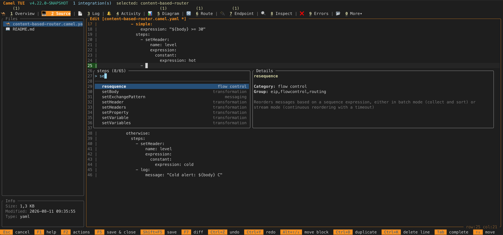
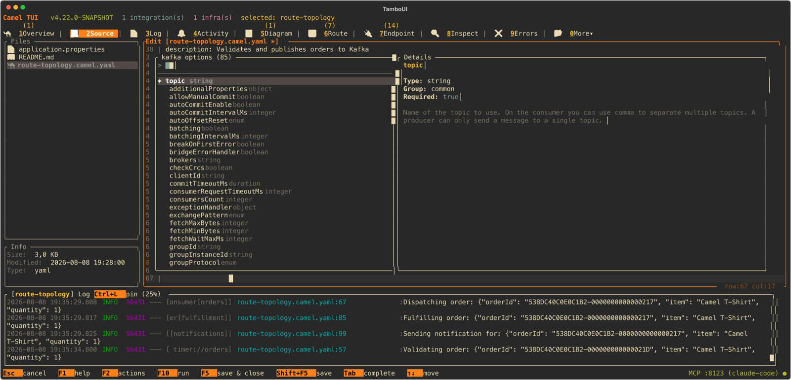
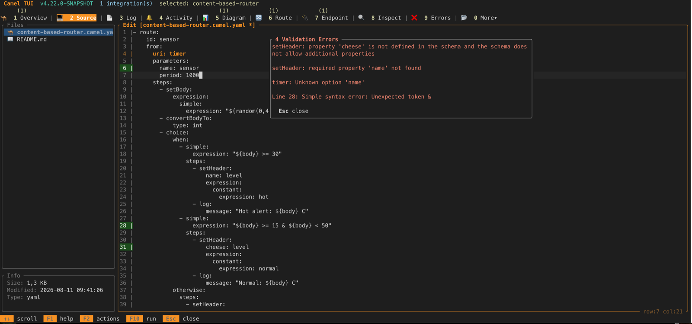
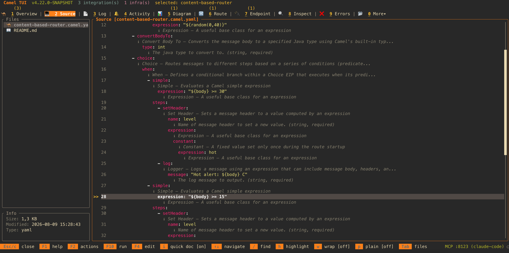
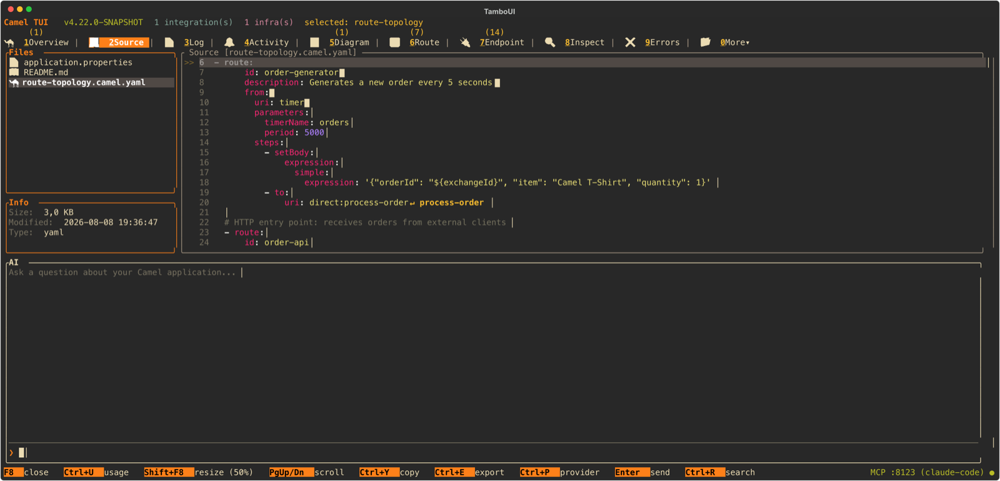

Two weeks ago we [introduced the Camel TUI](/blog/2026/07/camel-tui/) -- a terminal dashboard for
monitoring and managing Apache Camel integrations. Since then, development has continued at a rapid
pace. This post covers the latest additions landing in Camel 4.22.

## Open Any Project

You can now launch the TUI directly from any existing Camel project -- Spring Boot, Quarkus,
or Camel Main -- by pointing it at the project directory:

```bash
camel tui .
```

The TUI detects the project type from `pom.xml`, opens it, runs it (via F10), and gives you the full dashboard
experience for troubleshooting or light development. No extra setup, no plugins to install --
just point the TUI at your project and go.

## A Low-Code YAML Editor

The biggest addition is a built-in source editor in the Source tab. What started as a read-only
source viewer with inline documentation has evolved into a mini low-code editor for Camel YAML DSL
routes and `application.properties` files.

The editor is designed for prototyping and quick edits -- sketching out a new route, tweaking
an endpoint option, or experimenting with an EIP pattern while your application is running.
It is not intended to replace a full IDE for project-based development. If you are looking for
a graphical UI development experience, check out [Kaoto](https://kaoto.io) or
[Karavan](https://github.com/apache/camel-karavan).

### Tab Completion

Press **Tab** anywhere in a YAML route file, and the editor offers context-aware completions:





- **EIP names** -- `choice`, `split`, `aggregate`, `filter`, and all other EIPs. The autocomplete
  popup shows the EIP category label (routing, transformation, error handling, etc.) to help you
  pick the right one.
- **EIP options** -- After selecting an EIP, Tab again to see its available options with placeholder
  values.
- **Component names** -- Type a `to:` or `from:` URI and Tab to browse all available components.
- **Endpoint options** -- After the component name, Tab to see the endpoint's query parameters.
- **Expressions and data formats** -- Tab completion for expression languages (`simple`, `jsonpath`,
  `xpath`, etc.) and data format options (`json-jackson`, `csv`, `avro`, etc.).
- **`application.properties`** -- Tab completion for `camel.*` configuration keys, including
  Spring Boot configuration metadata when available.

The completion engine is tree-driven, generated from the canonical YAML DSL schema and the Camel
catalog metadata. It understands the nesting structure of the YAML DSL, so completions are
scoped to where you are in the document -- you only see options that are valid at the current
cursor position.

### Validate on Save

When you save a file (Ctrl+S), the editor validates the content:

- **YAML route files** are validated against the Camel YAML DSL schema. Errors are shown in a
  popup with the line number and description.


- **`application.properties`** files have their `camel.*` keys validated against the catalog,
  catching typos in property names.

### Editor Features

The editor also includes:

- **Inline quick docs** -- press `i` to toggle inline documentation for the component or EIP
  under the cursor.


- **Cross-route navigation** -- jump indicators show where routes connect to each other
  (via `direct`, `seda`, etc.), and you can jump between them.
- **Go to route** -- press `g` to open a type-ahead popup listing all routes in the file,
  letting you quickly jump to any route by name.
- **Confirm before discard** -- pressing Esc with unsaved changes prompts for confirmation.
- **Row:col indicator** in the status bar so you know where you are.
- **Plain mode** (toggle with a key) strips syntax coloring and expands the panel to full width without border lines, for easy multi-line copy/paste.

The combination of Tab completion, validation, and inline docs means you can write and iterate
on Camel routes without leaving the terminal -- a low-code experience for the command line.

## AI Panel: Bring Your Own LLM

The F8 AI prompt panel now supports a wide range of LLM providers:

- **Anthropic** (Claude) -- auto-detected when `ANTHROPIC_API_KEY` is set, including Vertex AI.
- **Azure OpenAI** -- auto-detected when `AZURE_OPENAI_API_KEY` and `AZURE_OPENAI_ENDPOINT` are set.
- **Google Gemini** -- auto-detected when `GEMINI_API_KEY` is set.
- **OpenAI** (and any OpenAI-compatible API) -- when `OPENAI_API_KEY` is set. Works with any provider
  that implements the OpenAI API (Groq, Together, etc.) by setting a custom URL.
- **IBM watsonx.ai** -- auto-detected when `WATSONX_API_KEY` and `WATSONX_PROJECT_ID` are set.
- **Ollama** -- for local models, auto-detected when Ollama is running on localhost.



The panel auto-detects which provider to use based on your environment variables, so you just
set the key and start chatting. You can also switch providers on the fly from within the panel.
Token usage is tracked per conversation.

The TUI also comes with a built-in MCP server, so any external AI coding assistant
(Claude Code, Cursor, Windsurf, etc.) can connect to the TUI and observe, interact with,
and control your running Camel application from the outside -- reading routes, errors, traces,
sending messages, stopping routes, and more.

## Other Improvements

A few more additions since the intro blog:

- **HTTP probe** -- A lightweight Postman-like tool for sending HTTP requests to your running
  application's endpoints, directly from the TUI.
- **Secrets tab** -- Browse secrets from configured vault providers (AWS, Azure, GCP, HashiCorp, CyberArk).
- **JFR tab** -- View Java Flight Recorder runtime events (route, processor, exchange) when
  JFR instrumentation is enabled.
- **Clickable hyperlinks** -- URLs in the HTTP tab and infrastructure service console URLs are
  now clickable hyperlinks in terminals that support them.
- **Destructive action confirmations** -- Actions like "Stop All" now prompt for confirmation,
  configurable in the Settings dialog.

## Try It

All of this ships in Apache Camel 4.22. Install the Camel CLI and try it:

```bash
curl -fsSL https://camel.apache.org/install.sh | sh
camel run myRoute.yaml --dev
```

Then in another terminal:

```bash
camel tui
```

Navigate to the Source tab, open a YAML file, and press Tab to see the completion in action.

## Roadmap

The TUI is actively developed and will continue to receive improvements and new features
in upcoming Camel releases. Stay tuned!

## About the Screenshots

The screenshots in this blog post were captured entirely by an AI agent (Claude Code) connected
to the running TUI via its built-in MCP server. The agent navigated the TUI, opened files,
entered the editor, triggered Tab completion, saved with intentional errors, toggled quick docs,
and opened the AI panel -- all through MCP tool calls, without any human interaction with the
terminal.

