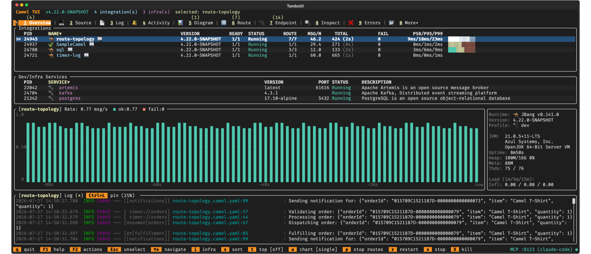

Apache Camel 4.22 LTS has just been [released](/blog/2026/08/RELEASE-4.22.0/).

This is a **Long Term Support (LTS)** release, which means it will receive patch releases with
bug fixes and security updates for approximately one year. The supported LTS lines are now
**4.18.x** and **4.22.x** (4.14.x reaches end of life with this release).

This release introduces a large set of new features and noticeable improvements that we will cover in this blog post.

The headline features in this release are:

- **Camel TUI** -- A brand-new terminal application for monitoring, managing, and developing Camel
  integrations with 30+ tabs, built-in YAML DSL editor with Tab completion, AI assistant, and more.
  See the dedicated [Camel TUI](/blog/2026/07/camel-tui/) blog post.
- **Camel CLI Installer** -- One-line install scripts for macOS/Linux and Windows, with self-update and
  doctor diagnostics. See the dedicated [Camel CLI Launcher Installers](/blog/2026/07/camel-cli-launcher-installers/) blog post.
- **Camel AI** -- A unified AI tool abstraction (`camel-ai-tool`) and built-in MCP server let you define a tool once
  as a Camel route and use it with LangChain4j, Spring AI, and OpenAI -- and expose it to any MCP-compatible AI agent.
  See the dedicated [Camel Routes as AI Tools](/blog/2026/08/camel-ai-tools-mcp-422/) blog post.
- **Secure Out of the Box** -- Continued the security-by-default effort across the framework with
  JEP-290 deserialization filters, dynamic URI allow-lists, download containment, path traversal
  prevention, credential masking, and JWT hardening. Camel aims to be secure without extra configuration.

## Camel Core

### Splitter EIP Enhancements

The Splitter EIP has been enhanced with three new capabilities:

- **Chunking** -- Process items in fixed-size batches with `chunkSize`.
- **Error threshold** -- Stop splitting after N consecutive failures with `errorThreshold`.
- **Watermark resume** -- Resume from the last successfully processed item with watermark tracking.

### Virtual Thread Readiness

Continued the effort to replace `synchronized` blocks with `ReentrantLock` across dozens of components
(OAuth, security, AI, telemetry, metrics, MLLP, and more), improving compatibility with virtual threads.

### Secure Out of the Box

We continue the effort to make Camel secure by default, without requiring extra configuration.
This release adds JEP-290 deserialization filters, dynamic URI allow-lists for `toD` and `enrich`,
download containment for cloud storage consumers, path traversal prevention in tar/zip archives,
header filter strategy fixes across more components, stronger credential masking in logs and URIs,
and JWT authentication hardening for the embedded HTTP server. The goal is that Camel should be
safe to run in production without needing to remember a checklist of security options to enable.

## Camel TUI

The Camel TUI (Terminal User Interface) is a brand-new feature in Camel 4.22. It is a full-featured
terminal application for monitoring, managing, and developing Camel integrations.
See the dedicated [Camel TUI](/blog/2026/07/camel-tui/) blog post for an introduction and visual tour.



The TUI provides a rich set of tabs for observing your running Camel application: routes, endpoints,
consumers, activity, errors, history, diagrams, health, OpenTelemetry spans, JFR profiling, heap
analysis, CVE audit, catalog browsing, SQL queries, and much more -- all from your terminal.

It also includes an embedded AI assistant panel (F8) with support for OpenAI, Azure OpenAI,
Google Gemini, and IBM watsonx.ai.

### Built-in YAML DSL Editor

The latest work on the TUI is a built-in source editor for Camel YAML DSL routes, with
**Tab completion** for:
- EIP names and options
- Component names and endpoint options
- `application.properties` configuration keys

The editor validates Camel YAML files and `camel.*` properties on save, showing errors inline.
Combined with the inline quick-documentation viewer, you can develop and iterate on routes
without leaving the terminal.

## Camel CLI

The Camel CLI has been promoted from _Preview_ to **Stable** support level.

### Website Installers

Installing the Camel CLI is now as simple as a one-liner. See the dedicated
[Camel CLI Launcher Installers](/blog/2026/07/camel-cli-launcher-installers/) blog post for details.

Two canonical installer scripts are now available:

```bash
curl -fsSL https://camel.apache.org/install.sh | sh
```

```powershell
irm https://camel.apache.org/install.ps1 | iex
```

The installers download from Maven Central, verify SHA-256 checksums, and validate
that a Java 17+ runtime is available. Installation is always per-user and never requires `sudo`.

### Self-Update and Doctor

`camel self-update` checks for and installs newer launcher releases. `camel doctor` now
additionally reports every Camel CLI installation found on the machine across package managers,
flagging conflicts.

### OpenAPI UI

`camel run --openapi-ui` exposes Swagger UI for REST DSL OpenAPI at `/q/openapi` on the
embedded HTTP server, making it easy to explore and test REST APIs during development.

### Route Diagrams from Source Files

`camel cmd route-diagram` and `camel cmd route-topology` now accept source files directly,
so diagrams can be generated at design time without starting the application:

```bash
camel cmd route-diagram routes/*.yaml
camel cmd route-topology routes/*.yaml
```

### JFR Now Works

`camel run --jfr` now actually starts a Java Flight Recorder recording (previously the flag
was accepted but had no effect). Camel runtime events (route, processor, exchange) are
captured automatically.

### Other CLI Improvements

- `camel export --parent-pom` option for custom parent POM.
- `camel run --resource-dirs` option for additional resource directories.
- `camel run --jvm-args` option for custom JVM arguments.
- Native `camel.exe` in the WinGet package (cross-compiled with llvm-mingw).
- Azure OpenAI, Google Gemini, and IBM watsonx.ai support for `camel ask` and TUI F8 panel.

## Camel AI

This release brings a major step forward for Camel's AI integration story. See the dedicated
[Camel Routes as AI Tools](/blog/2026/08/camel-ai-tools-mcp-422/) blog post for a deep dive.

### Unified AI Tool Component (`camel-ai-tool`)

A new `camel-ai-tool` component provides a unified way to define AI-callable tools as Camel routes,
replacing both `camel-langchain4j-tools` (now deprecated) and `camel-spring-ai-tools` (now removed).
Define a tool once, and it works with LangChain4j, Spring AI, OpenAI, and any MCP-compatible AI agent:

```java
from("ai-tool:weather?tags=weather&description=Get weather&parameter.city=string")
    .setBody(constant("{\"city\": \"Paris\", \"temp\": \"22C\"}"));
```

The `AiToolRegistry` listener SPI notifies consumers when tools are added or removed, and
`argSchema` supports raw JSON Schema for complex tool parameter definitions.

### Built-in MCP Server

The MCP server can now be embedded directly in your Camel application (Main, Spring Boot, or Quarkus).
The `McpServerBridge` watches the `AiToolRegistry` and exposes matching tools over the MCP protocol,
so any MCP-compatible AI agent can discover and call them. Tags control which tools are visible to
external clients.

### Camel OpenAI

The `camel-openai` component gained several new capabilities:

- **Responses API** -- A new `openai:responses` operation calls the OpenAI Responses API with support for
  text/image input, structured output, server-side multi-turn state, and hosted tools (`web_search`,
  `file_search`, `code_interpreter`).
- **Audio speech and translation** -- New operations for text-to-speech and audio translation.
- **Parallel MCP tool execution** -- Execute multiple tool calls from a single LLM response concurrently.
- **MCP tool refresh** -- The agentic loop now subscribes to `tools/list_changed` notifications and
  refreshes the tool list automatically, as the MCP specification expects.
- **Configurable error strategies** -- Control how tool execution errors and hallucinated tool names
  are handled (`failExchange` or `repromptModel`).
- **Token budget enforcement** -- A `maxToolCallingRoundTrips` limit (default 10) prevents runaway
  tool-calling loops.

## Camel MCP Server

The Camel MCP Server has been promoted from _Preview_ to **Stable** support level.

The MCP server can now be embedded directly in `camel run`, `camel dev`, and Camel Main applications
via `camel.server.mcp-*` configuration properties and the new `McpServerEngine` SPI with a
Vert.x-based implementation. See the [Camel Routes as AI Tools](/blog/2026/08/camel-ai-tools-mcp-422/)
blog post for the full architecture.

### Camel JBang MCP Server

The standalone Camel JBang MCP Server (used by AI coding assistants like Claude Code) also received
significant improvements:

- **Security-first execution layer** -- validates tool invocations and protects against unauthorized access.
- **Route cost estimation** -- `camel_route_cost_estimate` estimates the cost of running a route with a given LLM.
- **Dependency security audit** -- `camel_dependency_security_audit` audits dependencies for vulnerabilities.
- **Security scan** -- `camel_security_scan` analyzes routes for security concerns.
- **AI pipeline scaffold** -- `camel_ai_pipeline_scaffold` scaffolds an AI pipeline from a description.
- **Full documentation** -- retrieve full AsciiDoc documentation from the catalog.
- **CVE advisories** -- published Camel CVE security advisories are now part of the catalog.
- **Session management** -- keep-alive pings and idle TTL eviction prevent orphaned sessions.

## Observability

### Percentile Latency Statistics

Camel now tracks percentile latency statistics (p50, p95, p99) on the base performance counters.
These are available via JMX, the dev console, the TUI, and the CLI. The throughput MBean attribute
also now uses EWMA (exponentially weighted moving average) smoothing for more stable readings.

### JFR Runtime Instrumentation

`camel-jfr` can now emit JFR events during message routing (opt-in with
`camel.main.startup-recorder-runtime-enabled=true`), not just at startup. This enables
runtime profiling of route execution with standard Java Flight Recorder tooling.

### SQL Trace Dev Console

A new SQL Trace dev console captures and displays SQL queries executed by Camel routes,
visible in the TUI, CLI, and through the dev console API.

### Heap Histogram

A new heap histogram dev console and TUI panel shows instance counts and byte usage per class,
useful for diagnosing memory issues.

### Google Cloud Span Decorators

New span decorators for Google Cloud AI/ML, messaging, and storage components provide
richer trace context for Google Cloud service calls.

## Camel Kafka

### Correctness Fixes

This release includes a major correctness fix campaign for the Kafka component:

- **Manual commit fix** -- `allowManualCommit=true` no longer auto-commits offsets; only
  explicit `KafkaManualCommit.commit()` calls commit.
- **Batch auto-commit fix** -- Fixed the batching consumer committing unprocessed offsets.
- **saslAuthType fix** -- Generated SASL configuration no longer overrides explicit settings.
- **Producer scalar nodes** -- Scalar Jackson `ValueNode` bodies are no longer silently dropped.
- **Auto-generated groupId** -- Now shared across all consumer threads (previously each thread
  got its own UUID, causing duplicate processing).

### Batch Exchange Headers

The batch exchange now carries `CamelKafkaTopic` and `CamelKafkaPartition` headers when all
records in the batch share the same value.

### Unified Reconnection Task

The consumer's reconnection logic is now a single background task visible in TUI, CLI, and
management tooling.

## Camel Spring Boot

### MCP Server Starter

A new `camel-mcp-server-starter` integrates the Camel MCP server bridge with Spring AI's MCP server.
Camel route tools defined with `ai-tool:` are automatically exposed alongside Spring AI's native
`@McpTool` beans on the same MCP server, with no extra wiring needed.

### Platform HTTP Starter Hardening

The `camel-platform-http-starter` received a batch of fixes aligning it with Spring Boot 4 idioms:
Spring MVC mappings are now unregistered when a route stops, executor ownership and exchange lifecycle
are corrected, `httpMethodRestrict` no longer silently widens to all methods on unparsable verbs,
and the `CookieHandler` contract is properly honored.

### Profile Support

Configuring `camel.main.profile` via Spring Boot properties now works correctly, so you can
set `camel.main.profile=prod` in `application.properties` to activate the production security
profile.

### Spring AI 2.0

The `camel-spring-ai-*` components have been upgraded to Spring AI 2.0, which targets
Spring Boot 4.1 and Spring Framework 7, aligning with Camel's current baseline.

### Observability Defaults

Observability services defaults are now shipped via an `EnvironmentPostProcessor`, enabling
zero-config metrics and tracing when the observability infrastructure stack is running.

## Circuit Breaker EIP

The Circuit Breaker EIP received a modernization effort:

- **Resilience4j** duration options now accept Camel duration expressions (`60s`, `1m`, `PT1M`)
  alongside plain millisecond values, and async (non-blocking) processing is now supported.
- **Fault Tolerance** gained live call counters (successful, failed, not-permitted) and a
  `transitionToCloseState` JMX operation.
- Multiple correctness fixes for timeout handling, exchange property preservation, and
  state management during suspend/resume.
- `onFallbackViaNetwork()` has been deprecated (it was never supported by any current implementation).

## New Components

- `camel-ai-tool` -- Unified AI tool definition component for LangChain4j, Spring AI, and OpenAI.
- `camel-clickhouse` -- ClickHouse column-oriented database integration.
- `camel-duckdb` -- DuckDB embedded analytics database.

## New Language

- `camel-jactl` -- [Jactl](https://jactl.io) scripting language for Camel routes.

## Test Infrastructure

### New Modules

Four new test-infra modules have been added:

- `camel-test-infra-clickhouse` -- ClickHouse database.
- `camel-test-infra-cyberark-vault` -- CyberArk Conjur vault.
- `camel-test-infra-duckdb` -- DuckDB embedded analytics database.
- `camel-test-infra-observability` -- Observability stack (Prometheus, VictoriaTraces, VictoriaLogs, Perses).

### Web Consoles

Infrastructure services started with `camel infra run` now expose web console URLs when available
(e.g. Kafka UI, management consoles). The URLs are shown as clickable hyperlinks in the TUI and CLI,
making it easy to jump straight to the admin UI of the service you just started.

### Observability Stack

A new observability infrastructure stack is available with `camel infra run observability`. It bundles
Prometheus, VictoriaTraces, VictoriaLogs, and Perses (dashboard) for out-of-the-box metrics,
distributed tracing, and log aggregation during development. Combined with `--observe` on `camel run`,
zero configuration is needed -- Camel automatically scrapes metrics and exports traces and logs to
the running stack.

## Other Notable Changes

- `camel-aws` modules migrated from `apache-client` to `apache5-client` (Apache HttpClient 5).
- `camel-aws-bedrock` gained `invokeAgent` and `invokeInlineAgent` operations.
- `camel-aws2-transcribe` implements all 21 declared operations (previously stubbed).
- `camel-debezium` upgraded to 3.6.
- `camel-keycloak` gained federated identity linking, audience validation, and token type validation.
- `camel-minio` upgraded to 9.x with several API breaking changes.
- `camel-opensearch` gained `OpenSearchClient` as a component option.
- `camel-pqc` now uses authenticated encryption (AEAD) instead of unauthenticated ECB mode.
- `camel-wasm` migrated from Chicory to Endive for WebAssembly execution.
- `camel-weaviate` upgraded to client v6 with new operations (BATCH_CREATE, HYBRID_QUERY, BM25_QUERY, AGGREGATE).
- `camel-xmpp` upgraded Smack from 4.3.5 to 4.4.8.
- IBM MQ client upgraded to 10.0 with JMS vendor property handling fix.
- Massive flaky test fix campaign -- over 50 flaky tests stabilized across the test suite.
- Upgraded many third-party dependencies to latest releases.

## Deprecated Components

- `camel-langchain4j-tools` -- Use `camel-ai-tool` + `camel-langchain4j-agent` instead.
- `camel-reactive-executor-tomcat` -- Functionally identical to the built-in `DefaultReactiveExecutor`.

## Removed Components

- `camel-spring-ai-tools` -- Replaced by `camel-ai-tool`.

## Upgrading

Make sure to read the [upgrade guide](/manual/camel-4x-upgrade-guide-4_22.html) if you are upgrading from a previous
Camel version. This release has a substantial upgrade guide with breaking changes across Kafka, Resilience4j,
AI components, Weaviate, Minio, PQC, and more.

If you are upgrading from, for example, 4.4 to 4.8, then make sure to follow the upgrade guides for each release
in-between, i.e.
4.4 -> 4.5, 4.5 -> 4.6, and so forth.

The Camel Upgrade Recipes tool can also be used to automate upgrading.
See more at: https://github.com/apache/camel-upgrade-recipes

## Release Notes

You can find additional information about this release in the list of resolved JIRA tickets:

- [Release notes 4.22](/releases/release-4.22.0/)

## Roadmap

The next 4.23 release is planned in October.
