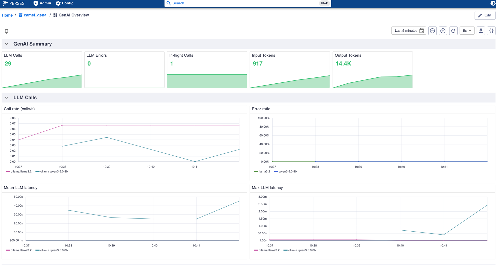
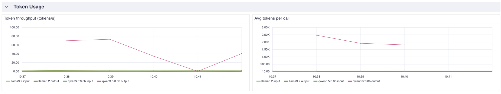

In [Part 1](/blog/2026/09/camel-genai-observability-jbang/) we prototyped GenAI observability with the
Camel CLI and TUI. This follow-up — **Phase 3 (Operate)** — shows the same `gen_ai.*` telemetry in a
**Spring Boot** application wired to the observability stack Camel ships for local development:
**Prometheus**, **VictoriaTraces**, and **Perses**.

The runnable sample lives in the [camel-spring-boot-examples](https://github.com/apache/camel-spring-boot-examples)
repository at [`genai-observability`](https://github.com/apache/camel-spring-boot-examples/tree/main/genai-observability)
(reworked in [PR #192](https://github.com/apache/camel-spring-boot-examples/pull/192)).

## Architecture

```
Terminal 1: ollama serve
Terminal 2: camel infra run observability
Terminal 3: mvn spring-boot:run

┌─────────────────┐   scrape :9876/observe/metrics   ┌──────────────┐
│  Spring Boot    │ ───────────────────────────────► │  Prometheus  │
│  Camel + 2 LLMs │                                  │  :9090       │
│  app :8080      │                                  └──────┬───────┘
│  mgmt :9876     │                                         │
└────────┬────────┘                                         ▼
         │ OTLP (Micrometer Tracing)                  ┌──────────────┐
         ▼                                            │   Perses     │
┌─────────────────┐         dashboards               │   :3000      │
│ VictoriaTraces  │ ◄────────────────────────────────└──────────────┘
│ :10428          │
└─────────────────┘
```

Two timer routes call two small Ollama models (`llama3.2:1b` and `qwen3:0.6b`), so every GenAI metric
and span carries a distinct `gen_ai.request.model` tag — ideal for Perses dashboards that compare
latency and token cost per model.

The `camel-observability-services-starter` moves Actuator endpoints to management port **9876** under
`/observe`, with Prometheus at `/observe/metrics`. Both standard Camel metrics and `gen_ai.*` metrics
share the same Micrometer registry.

Traces use the Spring Boot idiomatic setup: **Micrometer Tracing with the OpenTelemetry bridge**
(`spring-boot-micrometer-tracing-opentelemetry`, `micrometer-tracing-bridge-otel`,
`opentelemetry-exporter-otlp`). Spring Boot auto-configures the OTLP exporter and a tracing handler
on the `ObservationRegistry`. Camel route spans (via `camel-opentelemetry2`) and `gen_ai.*` client
spans land in the same VictoriaTraces trace.

## Quick start

### Prerequisites

```shell
java -version    # 17+
mvn -version     # 3.9+
camel version    # Camel CLI 4.22+
docker --version # used by camel infra run observability
ollama pull llama3.2:1b
ollama pull qwen3:0.6b
```

### Terminal 1 — Ollama

```shell
ollama serve
```

### Terminal 2 — Observability stack

```shell
camel infra run observability
```

This bundles Prometheus, VictoriaTraces, VictoriaLogs, and Perses — the same stack described in the
[Camel 4.22 what's new post](/blog/2026/08/camel422-whatsnew/#observability-stack). You can also start
it from the [Camel TUI](/manual/camel-jbang-tui.html) infrastructure panel.

The bundled Prometheus is pre-configured to scrape `host.docker.internal:9876/observe/metrics`.

| Service | Port | Role |
|---------|------|------|
| Prometheus | 9090 | Scrapes `/observe/metrics` on management port 9876 |
| VictoriaTraces | 10428 | Stores OTLP traces; UI at `/select/vmui` |
| Perses | 3000 | Metrics dashboards |

### Terminal 3 — Spring Boot

```shell
git clone https://github.com/apache/camel-spring-boot-examples.git
cd camel-spring-boot-examples/genai-observability
mvn spring-boot:run
```

Wait for log lines like:

```text
Started GenAiObservabilityApplication
[llama3.2:1b] LLM reply: Apache Camel is an integration framework...
[qwen3:0.6b] LLM reply: Enterprise Integration Patterns are...
```

## Verify GenAI metrics

Metrics are on the **management port**, not the application port:

```shell
curl -s http://localhost:9876/observe/metrics | grep gen_ai
```

Expected Micrometer names:

- `gen_ai_client_operation` — timer of LLM call duration
- `gen_ai_client_token_usage` — counter with tag `gen_ai_token_type=input|output`

Both series are tagged with `gen_ai_request_model` so you can split by model in Prometheus and Perses.

### Prometheus queries

Open [http://localhost:9090](http://localhost:9090) and try:

```promql
# Output tokens by model
sum by (gen_ai_request_model) (
  rate(gen_ai_client_token_usage_total{gen_ai_token_type="output"}[5m])
)

# LLM call rate per model
sum by (gen_ai_request_model) (rate(gen_ai_client_operation_count[5m]))

# Mean latency per model
avg by (gen_ai_request_model) (gen_ai_client_operation_seconds_sum)
  / avg by (gen_ai_request_model) (gen_ai_client_operation_seconds_count)
```

## Perses GenAI dashboard

The observability stack includes a general Camel overview dashboard at
[http://localhost:3000/projects/camel/dashboards/overview](http://localhost:3000/projects/camel/dashboards/overview).

Create the GenAI dashboard from the example definition:

```shell
curl -X POST http://localhost:3000/api/v1/projects \
  -H 'Content-Type: application/json' \
  -d '{"kind":"Project","metadata":{"name":"camel_genai"},"spec":{}}'

curl -X POST http://localhost:3000/api/v1/projects/camel_genai/dashboards \
  -H 'Content-Type: application/json' \
  --data @perses-genai-dashboard.json
```

Open [http://localhost:3000/projects/camel_genai/dashboards/overview](http://localhost:3000/projects/camel_genai/dashboards/overview).



The **GenAI Summary** row shows running totals: LLM calls, errors, in-flight calls, and input/output
token counters. **Call rate** and **Mean / Max LLM latency** split by `gen_ai.request.model` — a fast
model settles at the timer frequency; a slow *thinking* model's rate is capped by its own latency.



**Token throughput** and **Avg tokens per call** come from `gen_ai.client.token.usage`, split by model
and token type. With `llama3.2:1b` and a reasoning model like `qwen3`, the same one-sentence prompt can
produce an order-of-magnitude difference in output tokens — exactly the cost/latency trade-off these
panels surface.

> **Note:** Perses state lives in the container. After restarting `camel infra run observability`,
> re-run the two `curl` commands above to recreate the GenAI dashboard.

## Explore traces in VictoriaTraces

Open [http://localhost:10428/select/vmui](http://localhost:10428/select/vmui)

Useful trace search filters:

- `gen_ai.operation.name="chat"`
- `gen_ai.request.model="llama3.2:1b"`
- `camel.component="langchain4j-chat"`

Each span carries `gen_ai.usage.input_tokens`, `gen_ai.usage.output_tokens`,
`gen_ai.response.finish_reasons`, and `gen_ai.system` (e.g. `langchain4j`).

## Key configuration

### Maven dependencies (excerpt)

```xml
<dependency>
    <groupId>org.apache.camel.springboot</groupId>
    <artifactId>camel-observability-services-starter</artifactId>
</dependency>
<dependency>
    <groupId>org.apache.camel.springboot</groupId>
    <artifactId>camel-ai-observability-starter</artifactId>
</dependency>
<dependency>
    <groupId>org.apache.camel.springboot</groupId>
    <artifactId>camel-langchain4j-chat-starter</artifactId>
</dependency>
<dependency>
    <groupId>org.apache.camel.springboot</groupId>
    <artifactId>camel-yaml-dsl-starter</artifactId>
</dependency>
<dependency>
    <groupId>org.apache.camel</groupId>
    <artifactId>camel-ai-observability</artifactId>
    <version>${camel-version}</version>
</dependency>
<dependency>
    <groupId>dev.langchain4j</groupId>
    <artifactId>langchain4j-ollama</artifactId>
    <version>${langchain4j-version}</version>
</dependency>
<!-- Micrometer Tracing + OpenTelemetry bridge for OTLP export -->
<dependency>
    <groupId>org.springframework.boot</groupId>
    <artifactId>spring-boot-micrometer-tracing-opentelemetry</artifactId>
</dependency>
<dependency>
    <groupId>io.micrometer</groupId>
    <artifactId>micrometer-tracing-bridge-otel</artifactId>
</dependency>
<dependency>
    <groupId>io.opentelemetry</groupId>
    <artifactId>opentelemetry-exporter-otlp</artifactId>
</dependency>
```

The example builds `ChatModel` beans explicitly with plain `langchain4j-ollama` rather than
`langchain4j-ollama-spring-boot-starter`, which is not yet compatible with Spring Boot 4
([langchain4j#6236](https://github.com/langchain4j/langchain4j/issues/6236)).

### application.properties

```properties
# Two Ollama models (ChatModelConfiguration builds chatModel1/chatModel2 beans)
langchain4j.ollama.chat-model.base-url=http://localhost:11434
langchain4j.ollama.chat-model.temperature=0.2
langchain4j.ollama.chat-model.timeout=PT120S
langchain4j.ollama.chat-model-1.model-name=llama3.2:1b
langchain4j.ollama.chat-model-2.model-name=qwen3:0.6b

# YAML routes under src/main/resources/camel/
camel.main.routes-include-pattern=camel/*

# GenAI observability
camel.aiobservability.enabled=true
camel.opentelemetry2.enabled=true

# Actuator / Prometheus on management port 9876 (/observe/*)
management.endpoints.web.exposure.include=health,prometheus,info
management.prometheus.metrics.export.enabled=true

# OTLP trace export to VictoriaTraces (camel infra run observability)
management.opentelemetry.tracing.export.otlp.endpoint=http://localhost:10428/insert/opentelemetry/v1/traces
management.tracing.sampling.probability=1.0
```

### YAML routes (excerpt)

Routes live in `src/main/resources/camel/genai-route.camel.yaml`:

```yaml
- route:
    id: genai-chat-1
    from:
      uri: timer:genai1
      parameters:
        period: "15000"
      steps:
        - setBody:
            constant: "In one sentence, what is Apache Camel integration?"
        - to:
            uri: langchain4j-chat:model1
            parameters:
              chatModel: "#chatModel1"
        - log:
            message: "[${header.CamelLangChain4jChatResponseModel}] LLM reply: ${body}"
```

A second route calls `#chatModel2` on a 20-second timer with a different prompt.

## CLI/TUI vs Spring Boot

| Concern | Part 1 (CLI/TUI) | Part 2 (Spring Boot) |
|---------|------------------|----------------------|
| Time to first span | Minutes (`camel run --observe`) | Minutes + `camel infra run observability` |
| Metrics endpoint | `/observe/metrics` on port 9876 | `/observe/metrics` on port 9876 |
| Trace UI (dev) | TUI Spans tab (built-in) | VictoriaTraces VMUI |
| Per-model dashboards | Prometheus queries | Perses GenAI dashboard |
| Production fit | Prototyping, CI demos | Standard Spring ops (Actuator, K8s probes) |

Both parts use the same `camel infra run observability` stack, so you can prototype in the CLI/TUI
and switch to Spring Boot without reconfiguring collectors.

## Production checklist

1. Set `camel.aiobservability.enabled=true` explicitly in all environments
2. Scrape `/observe/metrics` on the management port (9876 by default with observability-services)
3. Export OTLP via Micrometer Tracing to your org's collector (Jaeger, Tempo, VictoriaTraces, etc.)
4. Alert on `gen_ai_client_token_usage` rate and `gen_ai_client_operation` p99, split by model
5. Use route IDs (`genai-chat-1`, `genai-chat-2`) in dashboards to attribute cost per integration

Disable globally with `camel.aiobservability.enabled=false` when running load tests without LLM overhead.

## Troubleshooting

| Issue | Resolution |
|-------|------------|
| Prometheus empty targets | Spring Boot must be running; stack scrapes `host.docker.internal:9876` |
| No traces in VictoriaTraces | Verify `management.opentelemetry.tracing.export.otlp.endpoint` points to port **10428** |
| `chatModel1` not found | Confirm `ChatModelConfiguration` and Ollama property prefixes |
| No `gen_ai` metrics | Add `camel-ai-observability-starter` + `camel-observability-services-starter` |
| Perses dashboard missing | Re-run the two `curl` commands after restarting the observability stack |

## Learn more

- [Part 1: CLI and TUI](/blog/2026/09/camel-genai-observability-jbang/)
- [AI Observability component source](https://github.com/apache/camel/blob/main/components/camel-ai/camel-ai-observability/src/main/docs/ai-observability.adoc) (4.23+)
- [Observability Services](/components/next/others/observability-services.html)
- [Camel AI components](/components/next/ai-summary.html)
- [Spring Boot example](https://github.com/apache/camel-spring-boot-examples/tree/main/genai-observability)

---

*This post was written by Omar Atie ([@atiaomar1978-hub](https://github.com/atiaomar1978-hub)) with assistance from Cursor Cloud Agent.*
