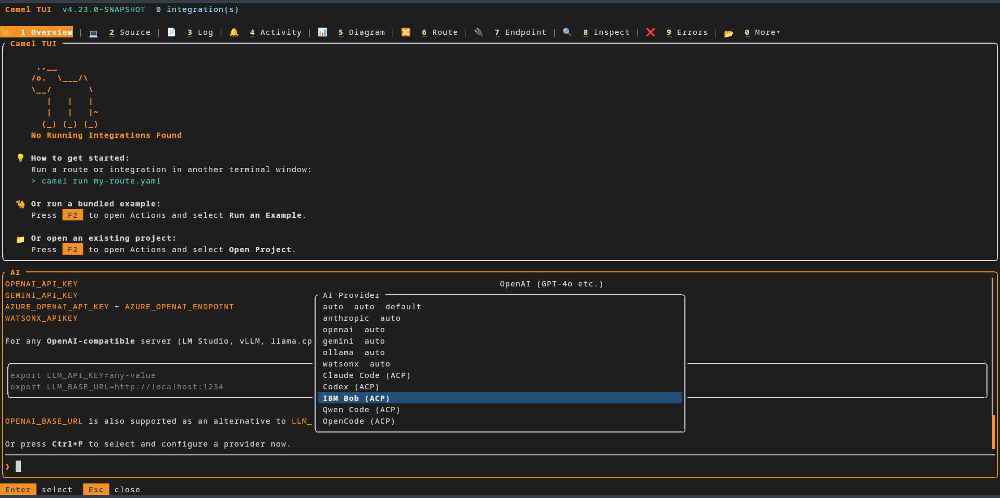
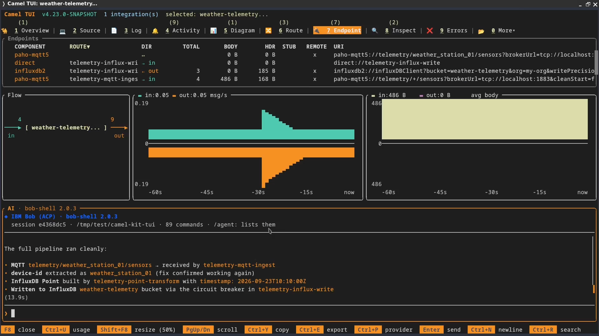
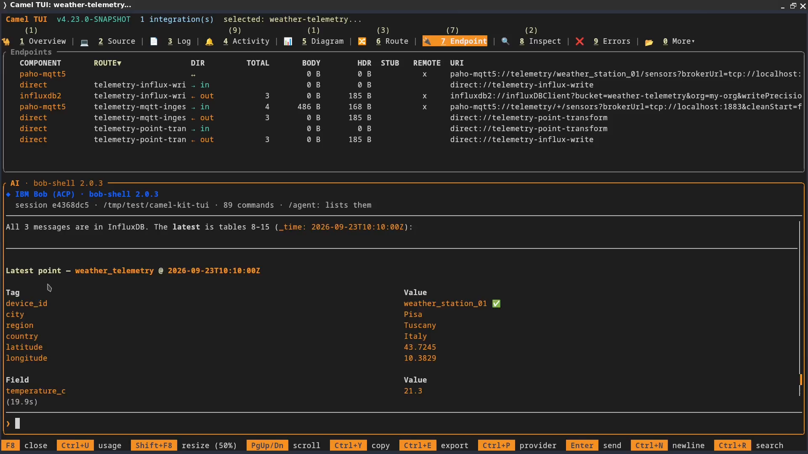

The next Apache Camel release, 4.23, is shaping up to be a great release, packed with new features. One I worked on is support for coding agents in Camel TUI through the [Agent Client Protocol](https://agentclientprotocol.com/get-started/introduction), or ACP.

It lets you use your coding agent directly in the TUI, with its existing setup and tools. The same agent can build an integration, inspect its live behaviour, fix a route, and verify the next message—all in one conversation.

To show what this means in practice, I'll use [Camel Kit](https://luigidemasi.github.io/camel-kit-web/), an open-source project I maintain that provides coding agents with workflows for Apache Camel development. We'll use those workflows to build a weather telemetry integration, then inspect it as it runs in Camel TUI.

## Bring your agent's setup with you

If you've already spent time configuring a coding agent to suit the way you work, that investment comes with you into Camel TUI. Your preferred models and reasoning settings, project instructions, memory, skills, custom prompts, and permission rules remain part of the agent's setup. You can keep using the conventions, context, and workflows you've refined for your own needs while working with Camel's routes, logs, and runtime state in the same terminal.

That means less setup to repeat, fewer project conventions to explain again, and familiar commands for recurring tasks. The agent continues to use its own login and configuration; Camel TUI does not need a separate API key.

In this walkthrough, those skills come from Camel Kit. They guide the agent through requirements, design, implementation, and validation. Bringing the agent into the TUI keeps that guidance available while you work with the running application.

The available features depend on what the agent and its ACP adapter expose; ACP does not guarantee complete parity with every standalone interface.

## How ACP and MCP fit together

ACP connects the TUI's AI panel to the coding agent. The TUI starts the agent as a local process and displays its responses, tool calls, and permission requests.

MCP gives that agent tools for working with Camel. When the ACP session opens, the TUI supplies its own MCP server, which exposes runtime information and actions.
There is no separate TUI MCP configuration to copy into the agent, and no need to launch the TUI with `--mcp`.

The implementation requires ACP v1 and HTTP MCP support. Presets cover IBM Bob, Claude Code, Codex, Qwen Code, OpenCode, and DeepSeek Harness (developer preview).
Other compatible agents can be configured through `acp:custom`. The [TUI manual](/manual/camel-jbang-tui.html#_using_a_coding_agent_acp) lists the commands and prerequisites for each preset.

## What Camel Kit adds

[Camel Kit](https://luigidemasi.github.io/camel-kit-web/) is an open-source toolkit, hosted on [GitHub](https://github.com/luigidemasi/camel-kit), that equips coding agents with skills and workflows for Apache Camel development. It guides you from requirements and design through implementation and testing, using MCP tools to consult documentation, check component options, and validate routes. This helps reduce repeated prompting, avoid guessed configuration options, and catch errors in generated routes. Because those skills live in the agent's project setup, they remain available when you use the agent inside Camel TUI.

[Camel Kit Knowledge MCP](https://luigidemasi.github.io/camel-kit-web/architecture/knowledge/) gives the agent access to searchable Camel documentation, component metadata, release notes, and security advisories. It also validates endpoint URIs against the Camel catalog, helping the agent check its configuration choices. Its source is available in the [Camel Kit Knowledge repository](https://github.com/luigidemasi/camel-kit-knowledge).

## The walkthrough: weather telemetry ingestion

Let's put those connections to work. We'll build an integration that receives JSON readings from weather stations over MQTT and stores them in InfluxDB 2.
It will run on Camel Main with YAML-only routes and use a circuit breaker to protect database writes.

The goal is to take the same conversation from requirements to a running integration and a check of the stored data. Camel Kit guides the development steps;
the TUI gives the agent access to the routes and logs once the application is running. We'll finish by asking the agent to publish an MQTT message and query InfluxDB for that reading.

I'm using IBM Bob for this walkthrough. It provides an ACP mode, and Camel Kit can install its skills and commands in a Bob project, so it fits both parts of the example.
The same approach applies to other agents supported by Camel Kit that meet the TUI's ACP requirements.

The video follows this workflow. The sections below walk through the project setup and the prompts used along the way.



## Prepare a Camel Kit project for your agent

The commands below use Bob as the example agent; choose the matching Camel Kit `--ai` target and TUI provider if you use another supported agent.

First, we need a project directory containing the Camel Kit skills that Bob will use to design and build our integration.

You need Java 17 or newer and [JBang](https://www.jbang.dev/documentation/jbang/latest/installation.html). Install [IBM Bob Shell](https://bob.ibm.com/docs/shell) and sign in using its normal setup. The TUI's `acp:bob` preset launches `bob acp` and uses Bob's authentication.

These are the setup commands I used in the recording. Create a project directory, install Camel 4.22.1 and the Camel Kit 0.4.1 plugin, and initialise the project for Bob:

```bash
mkdir camel-kit-tui && cd camel-kit-tui

jbang app install --fresh --force \
  -Dcamel.jbang.version=4.22.1 camel@apache/camel

camel plugin add kit \
  --gav=io.github.luigidemasi:camel-jbang-plugin-kit:0.4.1 \
  --description="Design Apache Camel Integrations with AI"

camel plugin add test
camel kit init --here --ai bob2
bob run --trust "Hello!"
```

The last command marks this project directory as trusted in Bob and starts an initial conversation.

`bob2` is Camel Kit's target name for IBM Bob 2; `acp:bob` is the provider name in the TUI. Camel Kit installs Bob's project skills and command definitions,
along with its MCP configuration in `.bob/mcp.json`. That configuration includes the Camel, Camel Knowledge, and Citrus servers used by the workflows.

The test plugin installed above supports Camel Kit's runtime verification with Citrus.
The [Camel Kit prerequisites](https://github.com/luigidemasi/camel-kit/blob/camel-kit-0.4.1/README.md#prerequisites) describe that setup and the Docker requirement for container-based checks.

## Try the Camel 4.23 snapshot

With the project prepared for Bob, the next step is to open it in a TUI that supports ACP. That support arrives in Camel 4.23.
Since it is not released yet, install the development snapshot under a separate command name, `camel-next`:

```bash
jbang app install --force --fresh --name camel-next \
  --repos=https://repository.apache.org/content/groups/snapshots/ \
  -Dcamel.jbang.version=4.23.0-SNAPSHOT camel@apache/camel

camel-next plugin add tui
```

The separate name keeps the regular `camel` command available for Camel Kit's build and test steps. You can check the snapshot installation with `camel-next version`; it should report `4.23.0-SNAPSHOT`.
Snapshots change as development continues.

The first TUI invocation downloads the plugin and its dependencies. You can check that it is available with `camel-next tui --help`.

## Connect your agent to the project

Start the TUI from the project directory so Bob can find the Camel Kit setup we just created:

```bash
camel-next tui
```

Before opening the AI panel, check which integration is selected.
The TUI chooses the agent's working directory when it starts: it uses the selected integration's source directory when available, or the directory where you launched the TUI otherwise.
For this new project, switch to **Overview** and press **Esc** to clear any integration selection so Bob starts in `camel-kit-tui` and can find the Camel Kit setup.

Press **F8** to open the AI panel, then **Ctrl+P** and select **IBM Bob (ACP)** (`acp:bob`).



*IBM Bob selected in the demo snapshot; the provider list can differ between snapshot builds.*

Then send your first message to start the agent session. Once the session has started, confirm the working directory in the panel header or with `/context`.

## Use Camel Kit from the AI panel

With Bob connected, we can reach the project's Camel Kit workflows from the AI panel. Enter `/agent:` to list the commands the agent advertises.
In the AI panel, agent skills, commands, and custom prompts use the `/agent:` prefix, keeping them separate from the TUI's own commands.

Camel Kit is a concrete use of this mechanism: its project commands can appear as `/agent:camel-brainstorm`, `/agent:camel-plan`, and `/agent:camel-execute`.
The TUI does not need a Camel Kit-specific integration to present them.

`/agent:camel-start` chooses the appropriate workflow for the current project. Here, we already know we want to design a new integration, so we can start directly with `/agent:camel-brainstorm`.
The main development stages are:

```text
/agent:camel-brainstorm → /agent:camel-plan → /agent:camel-execute
```

These commands cover design, planning, and implementation with verification. You can invoke a stage explicitly or follow the agent's handoff to the next skill.
Migration and troubleshooting have their own entry points, described in the [Camel Kit command reference](https://github.com/luigidemasi/camel-kit/blob/camel-kit-0.4.1/docs/commands.md).

The command list belongs to the agent and may contain additional utilities or internal stage skills. You do not need to invoke every `camel-*` entry: the workflows call their supporting skills as needed.

## Design a weather telemetry integration

Now we can give Bob the requirements for our weather telemetry integration. We'll start with Camel Kit's brainstorming workflow to agree on the design before moving to a plan and implementation.

Invoke `/agent:camel-brainstorm` in the AI panel, then supply this prompt:

```text
Design an integration that runs on Camel Main and uses YAML-only routes.
Name the project "Weather Station Telemetry Ingestion".

Consume JSON weather telemetry from MQTT topics whose names follow this pattern:
telemetry/weather_station_{id}/sensors

Store each reading in InfluxDB 2 with the following mapping:
- Tags: device_id, location.city, location.region, location.country,
  location.longitude, and location.latitude, stored as device_id, city, region,
  country, longitude, and latitude, respectively.
- Fields: all sensor and diagnostic measurements.

Protect the InfluxDB write operation with a circuit breaker to handle database
unavailability.
```

This is the sample payload for the design:

```json
{
  "device_id": "weather_station_01",
  "timestamp": "2026-09-18T15:00:00Z",
  "location": {
    "latitude": 43.7245,
    "longitude": 10.3829,
    "city": "Pisa",
    "region": "Tuscany",
    "country": "Italy"
  },
  "sensors": {
    "temperature_c": 24.5,
    "humidity_percent": 60.2,
    "pressure_hpa": 1013.2,
    "wind_speed_kmh": 12.5,
    "wind_direction_deg": 180,
    "rain_mm_last_hour": 0.0
  },
  "diagnostics": {
    "battery_percent": 88,
    "wifi_rssi_dbm": -65
  }
}
```

The design should make the mapping explicit: `device_id` and the five location values become tags; the sensor and diagnostic measurements become fields.
The brainstorm is also where we agree how to use the payload timestamp and what should happen to incoming readings while InfluxDB is unavailable.

Once you agree on the design, approve it when Bob asks. In the recording, I reply `yes`; Bob calls the planning skill, writes an implementation plan, and then calls the execution skill. I do not need to enter each command separately.

## Build and review the integration

During design and implementation, Bob may request permission to use skills or tools, run commands, or edit files. The TUI shows the agent's permission choices; read-only TUI tools are approved automatically.
Expect the number of prompts to depend on the operations and Bob's existing allow rules. Session-level "Always allow" choices can reduce repeated requests. **Ctrl+C** cancels the current turn.

The generated project separates the flow into three YAML routes: MQTT ingestion, mapping the JSON readings into InfluxDB tags and fields, and delivery to InfluxDB through a circuit breaker. It also includes connection settings and a Docker Compose setup for the MQTT broker and InfluxDB. Review these files and Bob's validation results before moving on to the live checks.

In the recording, the implementation summary reports partial verification because of a static-analysis limitation. I continue with the runtime checks below. You can also invoke `/agent:camel-validate` for an additional project check; that separate step is not shown in the video.

## Run it and check the stored telemetry

After implementation, ask Bob to check whether the MQTT broker and InfluxDB are already running. If either service is not running, ask Bob to start it using the generated Docker Compose setup. Then update the integration's connection settings to match. Ask it to start the integration and select it in the TUI, then inspect the routes and recent logs.

The first startup in the recording exposes a missing type declaration on the InfluxDB client bean. Bob corrects it and checks the logs again; the TUI then shows all three routes running.

With the integration running, follow up in the same conversation:

```text
Can you send an example message to the MQTT topic?
```

<br/>



*Bob publishes the first test message and checks whether the route received it ([09:53](https://www.youtube.com/watch?v=aoB3NYKNi5I&t=593s) in the video).*

Then ask:

```text
Can you run a query on InfluxDB searching for the latest message sent?
```

Bob finds the stored measurements, but the `device_id` tag contains a Java array representation instead of `weather_station_01`.

After I approve the fix, Bob corrects the expression that extracts the device identifier from the MQTT topic. 
The integration reloads in development mode, and Bob sends another reading and checks the logs.
We then repeat the publish-and-query check with a new test message.

<br/>



*The later query shows the corrected device identifier ([12:13](https://www.youtube.com/watch?v=aoB3NYKNi5I&t=733s) in the video).*

The final response shows `weather_station_01` with the expected location tags; 
the original point still retains its incorrect tag. Fixing the route changes subsequent writes, so check the message sent after the fix.

When repeating this check, ask Bob to query the device identifier and timestamp of the message you actually published, using a time range that includes it. 
Compare the returned tags and fields with that payload, including the diagnostic measurements. 

## Why Camel Kit and Camel TUI work well together

> ### _Inspect_ → _Fix_ → _Verify_  &nbsp;&nbsp;&nbsp; all in the same agent session 
>
> 
> The agent uses live results to guide its next code change, then checks that change against the running integration.
> 
> Camel Kit supplies the development skills, Camel TUI supplies the runtime tools.
> 
> The requirements, code changes, and observed results stay in the same conversation.

<br/>

The incorrect `device_id` in this example shows that workflow in practice. Bob uses the runtime evidence to identify the mapping problem, edits the route, and checks a new reading after the integration reloads. The skills used to build the integration remain available while diagnosing and correcting its behaviour.

That is the combination I wanted when adding ACP support: my agent and its skills available where I am already working with Camel.
Camel Kit gives that agent a process for building integrations, and Camel TUI gives me a view of what those integrations are doing.

Try it with your preferred compatible agent, and let us know how it fits your workflow.

## References

For the development tools, see [Camel Kit](https://luigidemasi.github.io/camel-kit-web/), [Camel TUI and its ACP support](/manual/camel-jbang-tui.html#_using_a_coding_agent_acp), [Camel JBang](/manual/camel-jbang.html), and [IBM Bob Shell](https://bob.ibm.com/docs/shell).
<br/>
For the integration, refer to [Camel Main](/components/next/others/main.html), [YAML DSL](/components/next/others/yaml-dsl.html), the [Paho MQTT 5 component](/components/next/paho-mqtt5-component.html), the [InfluxDB 2 component](/components/next/influxdb2-component.html), and the [Circuit Breaker EIP](/components/next/eips/circuitBreaker-eip.html).
<br/>
For the protocols, read the [Agent Client Protocol (ACP)](https://agentclientprotocol.com/get-started/introduction) and [Model Context Protocol (MCP)](https://modelcontextprotocol.io/docs/getting-started/intro) introductions.
