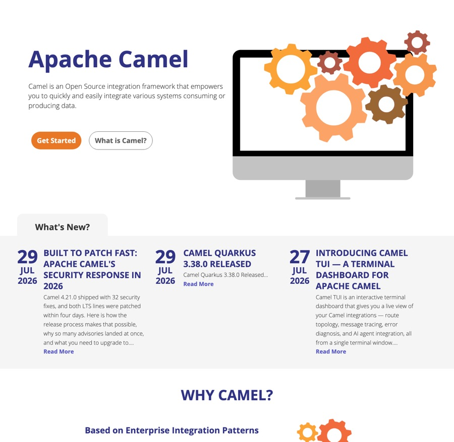
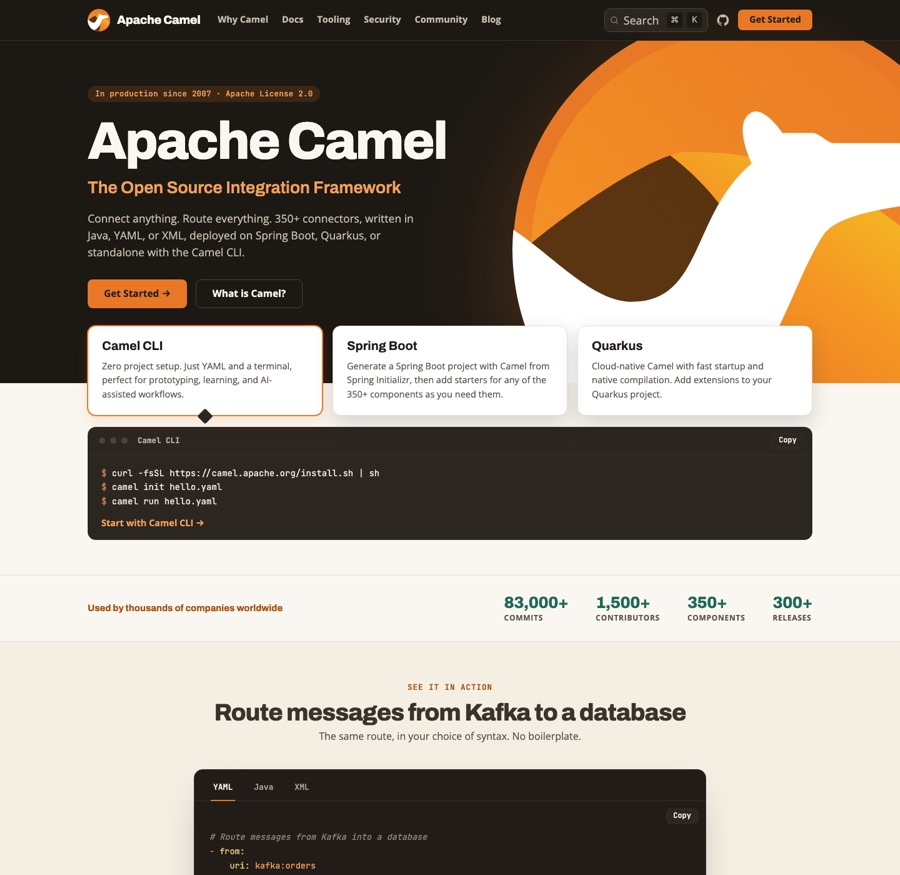

The Camel website has needed a modern front page for years. The old one said that Camel "is an Open Source integration framework that empowers you to quickly and easily integrate various systems", showed a picture of gears, and left the rest to you.

*The front page as it was until September 2026.*

True, but it could describe any integration product, and it did not tell a first-time visitor how to start.

Since that page was written, the visitor has changed. A growing share of the readers of camel.apache.org are not people but AI coding assistants and crawlers, reading the site on a developer's behalf. When someone asks their assistant how to get messages from Kafka into a database, the answer is shaped by what the assistant has read about Camel. The front page is the most authoritative page there is about Camel, so it has to answer that question for a person and for a model alike.

That is the mission of the new front page, and it is the most important change in the redesign.

## The front page

This is the page that replaces it:

*The new front page, September 2026.*

Read it from the top, the way a visitor does:

- **One sentence that says what Camel is.** Connect anything, route everything: 350+ connectors, written in Java, YAML or XML, deployed on Spring Boot, Quarkus or standalone with the Camel CLI. In production since 2007, Apache License 2.0.
- **Three ways to start, with the commands.** The Camel CLI comes first: install it, `camel init hello.yaml`, `camel run hello.yaml`. No project, no IDE, no Java compilation. Next to it, a Spring Boot project from Spring Initializr and a Quarkus extension, for the two runtimes most Camel applications run on.
- **The numbers.** 83,000+ commits, 1,500+ contributors, 350+ components, 300+ releases. Each figure was measured against the repository on a stated date, and the source data file records how to re-measure it. The page makes no claim it cannot back.
- **One real route, in the three syntaxes.** Messages from Kafka into a database, as YAML, Java and XML, with the `camel run` command that matches the tab you pick. A reader sees in ten seconds what a Camel route looks like, and a model sees the same route three times with the syntax named.
- **Why developers choose Camel**, in six short cards: connectors, three DSLs, AI-ready integration with the Camel MCP server and `camel trace` and `camel test` to verify AI-generated routes, the Enterprise Integration Patterns, a standard Maven or Gradle build, and open source. The section ends with a link to [why teams trust Camel in production](/trust/).
- **The rest of the ecosystem** moved below: Camel Core, Kamelets, Camel K, Karavan, the Kafka Connector and Karaf. The front page shows what most users use first, and everything else is one click away.
- **Latest from the blog**, and a closing invitation: Camel is your project, here is how to get involved.

The words on the page were chosen with both readers in mind. "Integration framework", "350+ connectors", "Java, YAML or XML", "Spring Boot", "Quarkus", "Enterprise Integration Patterns", "MCP server" and "Apache License 2.0" are the terms a person scans for and the terms a model associates with Camel. There is nothing on the page a visitor cannot run or check.

## The rest of the site

The front page sets the tone, and the other pages follow it:

- **Docs and website share one look.** The documentation pages now have the same header and footer as the rest of the site, so moving between a blog post, the user manual and a component page no longer feels like changing websites. Marketing pages scale with the viewport, and documentation pages, which carry a sidebar and a table of contents, get all the width they need.
- **Why Camel** is the first link in the top bar. The trust page, with the project's security track record, release cadence and adoption, used to hide in the footer; now it is one click from anywhere.
- **Search** runs on DocSearch v5, themed to match the site. The result curation carried over: core documentation ranks above component pages, and no single page can fill the list.
- **The blog** shows ten posts per page instead of three, with a compact card per post, and opens with a "Start here" rail of eight hand-picked posts for a newcomer.

URLs, RSS feeds and the documentation content are unchanged. Every link that worked before works now.

## The documentation is next

The design is done. The content is where the work is now, and it has already started.

**Code listings that are checked, not trusted.** The Camel documentation has thousands of examples, and for years the only check was a reader trying one. We now run them through the same validation that the Camel CLI and the MCP server give an AI assistant, at build time, so a broken example fails the build. The first pass over the 290 YAML examples on the Enterprise Integration Pattern pages found 71 wrong ones. The next pass over the 1,820 YAML route examples on the component pages found 87 failing on 28 pages. A third pass checked the XML examples against the schemas, every Java import against the source tree, and every property key against the catalog, and corrected more than a hundred more listings, some of which still used Camel 1.x and 2.x syntax. All of them are fixed in Camel 4.23, and the guards stay in the build so they cannot regress. AI assistants did most of the checking, with every finding verified against the Camel source code. The [local model benchmark](/blog/2026/09/camel-local-model-benchmark/) tells how that work started.

**A restructure of the content.** The user manual has grown for nineteen years, and its structure reflects that history. The next step is a restructure so that a newcomer, or an agent, lands on the right page without having to know how Camel evolved.

**Every page readable by machines.** Every documentation page is available as Markdown: replace `.html` with `.md` in the URL, and the page comes back as plain Markdown without navigation, which is what an assistant wants to read. [llms.txt](/llms.txt) describes Camel for AI agents in one file and points at versioned offline documentation bundles, with the catalog metadata and the YAML DSL schema included, for agents that work without internet access. The website pages themselves, this blog included, are not yet available as Markdown; that is the next step.

## Tell us what you think

The site is built in the open in [apache/camel-website](https://github.com/apache/camel-website). If something looks wrong, a link points at the wrong place, or a page does not read well to you or to your assistant, please [open an issue](https://github.com/apache/camel-website/issues). The front page is the first page a visitor and a model read about Camel, and we want it to be right.
