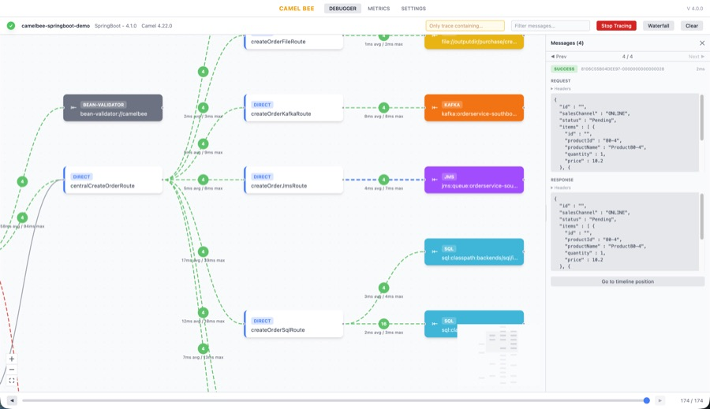
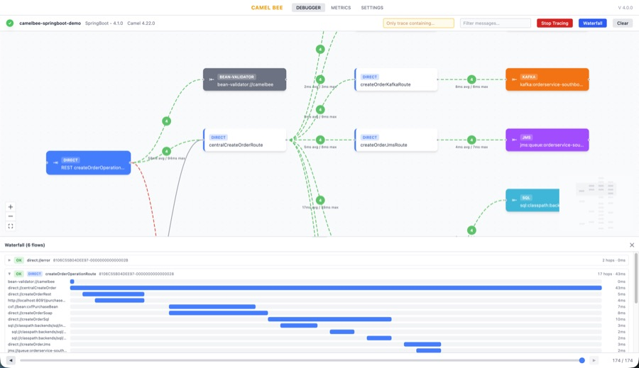
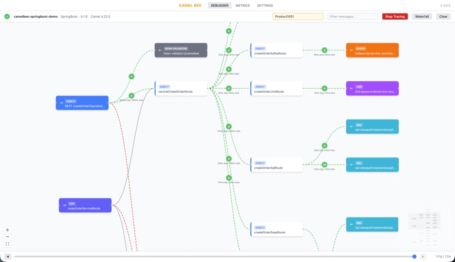

Apache Camel keeps raising the floor of what ships in the box. [Route topology
diagrams](/blog/2026/06/camel-route-topology/) and the [Camel TUI](/blog/2026/07/camel-tui/) both
arrived in 4.21, and both are very good at what they are for: understanding a route while you write
it, on the machine you write it on. As the TUI announcement puts it, it is "a development and
troubleshooting tool, not a production monitoring solution."

[CamelBee](https://github.com/camelbee/camelbee) is an open-source (Apache-2.0) library for the other
side of that line: after a route has been deployed somewhere you cannot attach a terminal to. You add
it as a dependency, and the application itself serves a debugger UI over HTTP. There is no sidecar,
agent or collector to install. The UI shows the live route topology, a latency waterfall per hop, and
traced messages with their request and response bodies, whether the app runs on a laptop, in a test
environment or in a Kubernetes pod.

## Why this exists

Route source tells you what the code says, not what actually happens when a message runs through it:
which path it takes, what each endpoint returns, and where the time goes. Logs can answer some of
that, but only for what someone thought to log in advance, and correlating them by hand is slow.
CamelBee watches the running application instead: open the topology it reports, switch tracing on,
reproduce the request, and follow it through the routes, in the same deployment where the problem
showed up. It does not keep a history; it records only what flows through while tracing is on.

This matters more now that a growing share of integration code is written with AI assistants.
Generated routes are often long and plausible-looking, and reading them line by line to understand
what they really do takes time. Seeing the topology they produce, and watching real messages move
through it, is often a quicker way to understand that code and to check that it does what was asked.

## Route topology and message tracing

CamelBee asks the running application which routes and endpoints it has and draws them as an
interactive graph. When tracing is on, messages animate along the connections as they flow. Tracing
is switched on and off from the UI, with no restart, and every traced exchange can be inspected in
full: headers, body, request and response, with a timeline to step back and forth through.



Exchanges created by `wireTap`, `multicast`, `split`, `recipientList` and `seda` are linked back to
the exchange that started them, so one request reads as one flow instead of many unrelated messages.
Failures are recorded on consumer-started routes too (timer, file, JMS), where there is no caller for
the error to be reported to.

CamelBee collects this through Camel's `EventNotifier`, so it works at endpoint boundaries: what
arrived, what was sent to each endpoint, and what came back. It does not step through individual
processors inside a route; for that, the TUI and the developer console are the right tools.

## The waterfall: where the time went

Every hop is drawn as a bar, positioned by when it started and sized by how long it took. A wide
parent bar over a few near-instant children is waiting rather than working, for example on a
redelivery delay, and that is visible at a glance instead of being worked out from log timestamps.



Selecting a bar highlights the matching connection on the topology graph, and selecting a connection
scrolls to its bars in the waterfall.

## Running it outside development

A tool that runs where real traffic runs needs safe defaults:

- **Login is required by default.** If no password is configured, one is generated and logged at
  startup. It can be turned off when the endpoints are already protected by the host framework.
- **Tracing starts off**, and once switched on it turns itself off again after a configurable idle
  period.
- **Sensitive values are redacted by default**: passwords, tokens, API keys, card numbers and more,
  based on a configurable key list. Bodies can be left out of capture entirely.
- **Capture can be limited to one transaction.** Give CamelBee an order id or correlation id and it
  records only the flow containing that value, plus the exchanges that flow spawns. Nothing else is
  recorded.



## Getting started

CamelBee supports Quarkus, Spring Boot, standalone Camel and Camel K. For Quarkus, add the core
library:

```xml
<dependency>
  <groupId>io.camelbee</groupId>
  <artifactId>camelbee-quarkus-core</artifactId>
  <version>4.1.0</version>
</dependency>
```

Enable it in `application.yaml`:

```yaml
camelbee:
  notifier-enabled: true
  route-configurer-enabled: true
  context-enabled: true
  tracer-enabled: true
  password: change-me

quarkus:
  index-dependency:
    camelbeecore:
      group-id: io.camelbee
      artifact-id: camelbee-quarkus-core
```

Then start the application and open `http://localhost:8080/camelbee`. The
[README](https://github.com/camelbee/camelbee) covers the setup for the other runtimes, the full
feature set with screenshots, and every configuration property with its default.

## Feedback welcome

CamelBee is a young project, and feedback from people running Camel in real environments is the most
useful thing it can get: what is missing, what is confusing, and what would make it worth adding to a
deployment. Issues and discussions are welcome on
[GitHub](https://github.com/camelbee/camelbee/issues).
