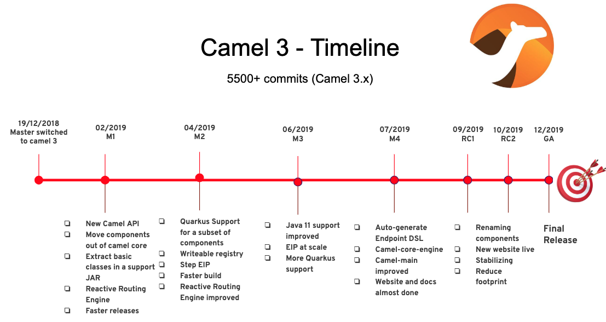
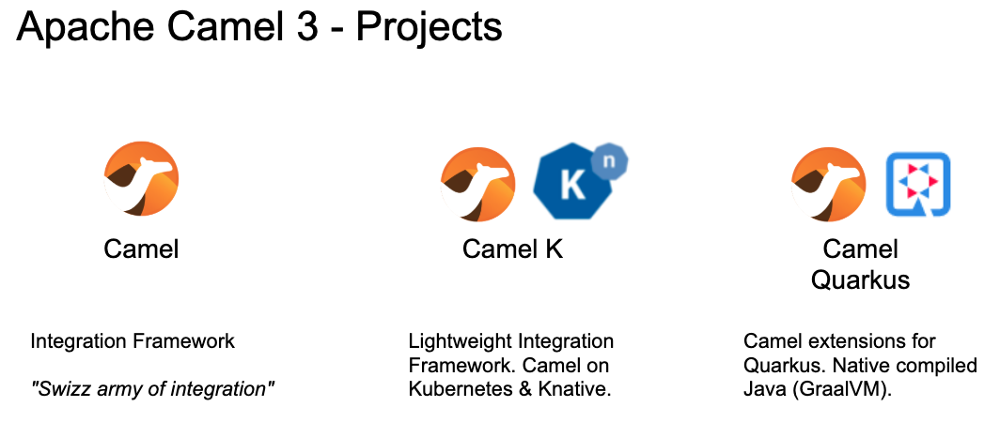

The Camel team is busy working on the last set of work for Apache Camel 3. Today the 2nd release candidate was built and published on a staging repository for [early adapters to give it a try](https://camel.465427.n5.nabble.com/VOTE-Release-Apache-Camel-3-0-0-RC2-Release-Candidate-2-td5844106.html).
As I am busy myself then I just wanted to write a short blog post to keep the community posted that Apache Camel 3 is on the way, and that we expect it to be released by end of this year (sometime in November or December).
The latest deadline is to release Camel 3.0 before December 19th 2019 as it was exactly on that day 1 year ago, we switched the master branch to become the work branch for Apache Camel 3. That means the total development time for Camel 3 would be 1 year.
Here is a illustration that highlights the timeline of Camel 3:

That is not all Apache Camel, is now a family of 3 projects (at this moment). So working on Camel 3 is not all we do. [Camel K](https://github.com/apache/camel-k/) and [Camel Quarkus](https://github.com/apache/camel-quarkus) are very promising for cloud-native integration (microservices and serverless).

These projects have their own lifecycle. Will will post more details about these projects, and what’s new in Camel 3 in the following months leading up to the final release of Camel 3. So stay tuned.

PS: If you are migrating Camel 2.x applications to Camel 3, then read the [migration guide](https://camel.apache.org/manual/latest/camel-3-migration-guide.html).