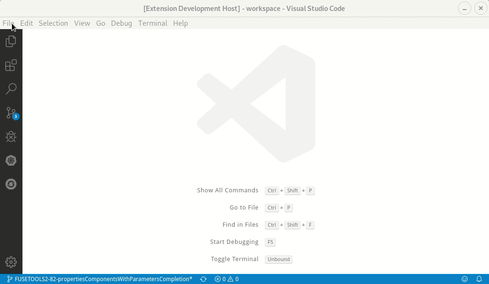
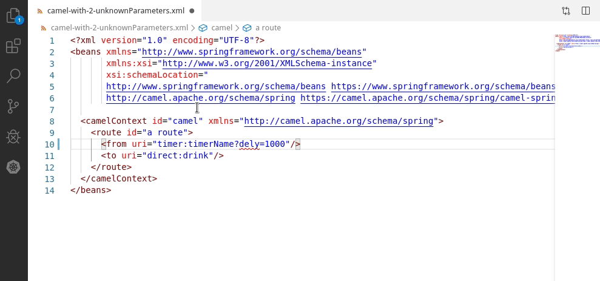
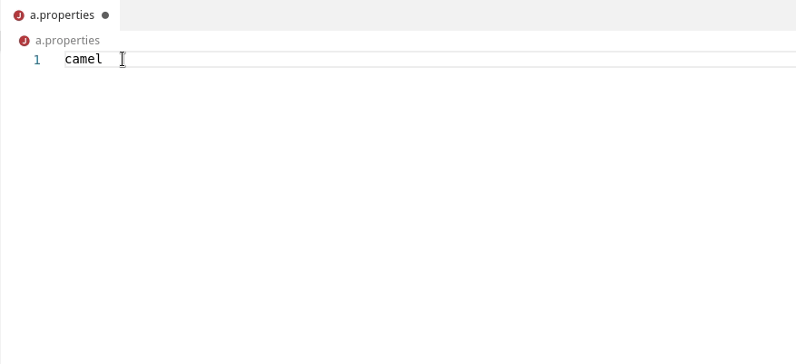

Disclaimer: this article has been first published on [developers.redhat.com](https://developers.redhat.com/blog/2019/12/16/vs-code-language-support-for-apache-camel-0-0-20-release/)

During the past months, several noticeable new features have been added to improve the developer experience of application based on Apache Camel. These updates are available in the [0.0.20 release of Visual Studio (VS) Code extension](https://marketplace.visualstudio.com/items?itemName=redhat.vscode-apache-camel).

Before going into the list of updates in detail, I want to note that I mentioned in the title the VS Code Extension release because VS Code extension is covering the broader set of new features. Don't worry if you are using another IDE, though, most features are also available in all other IDEs that support the Camel Language Server (Eclipse Desktop, Eclipse Che, and more).

### Camel 3 inside

Camel 3 was [released](https://camel.apache.org/blog/release-3-0-0.html) a few weeks ago, and the Camel Language Server is already relying on it internally. What does that mean for the end user? It means that the default catalog is now using Camel 3.

If you are still based on Camel 2.x, no problem; check out the following awesome feature.

### Camel catalog version options

A parameter is now available to choose the Camel catalog version that you want. This can be specified in *File -> Preferences -> Settings -> Apache Camel Tooling -> Camel catalog version*.

### Diagnostics with quick fixes and more precise range

Diagnostics are really useful to pinpoint issues in our code. In previous versions, the diagnostic range error was provided on the full Camel URI. Now, for invalid component parameter keys and invalid component parameter enum values, the range is more precise and is pointing to the exact incriminated key or value.

For unknown component parameter keys, there is also a quick fix provided if a component parameter key relatively similar exists. It is very useful in case of small typos.

### Additional Camel components

If you are using Camel components that are not part of Camel core catalog, it is now possible to provide the Camel component definition to have it fully supported by the tooling. The Camel component definition is defined as JSON. The JSON file can be found in the jar of the Camel component. The preference can be specified through *File -> Preferences -> Settings -> Apache Camel Tooling -> Extra-components -> Edit in settings.json*.

<iframe width="560" height="315" src="https://www.youtube.com/embed/U015RzlgFNM" allow="accelerometer; autoplay; encrypted-media; gyroscope; picture-in-picture" allowfullscreen></iframe>

### Properties file support

Camel allows you to configure general component properties using a Properties file (see [here](https://github.com/apache/camel/blob/cfc9abf5f464057fa343a1a70a25a72c33c408bd/examples/camel-example-main/src/main/resources/application.properties#L42) for an example). Completion is available for component ids and component property keys.

### What's next?

This is very opened for the future. There will surely be improvements directed to Apache Camel K support. The Fuse Tooling team is awaiting your feedback on [JIRA](https://issues.redhat.com/browse/FUSETOOLS2), on one of the [Camel Tooling GitHub repository](https://github.com/camel-tooling). or whatever channel you prefer. it will help drive the future roadmap.